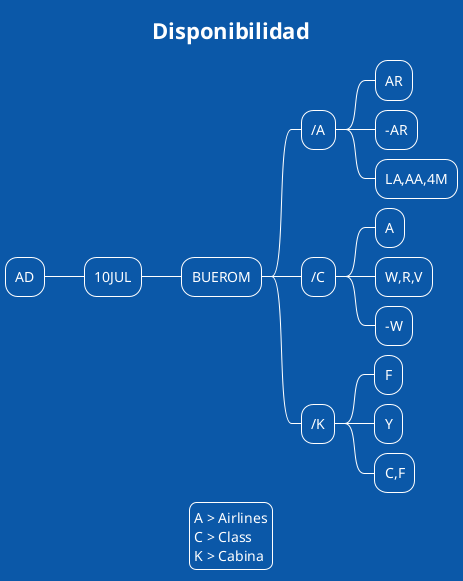

[[toc]]

## Capítulo I 

Este primer módulo sirve para familiarizarnos con la nomenclatura, el idioma que maneja el **GDS**, la forma en que el sistema entiende nuestras preguntas y lo que espera de nosotros.  Si bien existe el modo gráfico, es conveniente que el usuario, el ejecutivo de la agencia, se familiarice con el idioma que habla todo el mundo en la industria.  

Aprenderemos en este primer capítulo, como codificar ciudades, paises, prestando especial atención a la similitud de muchos puntos, que genera siempre errores de interpretación.  Veremos las tablas de horarios entre ciudades.  La disponibilidad de vuelos, como refinar esa disponibilidad y hacer las búsquedas mas precisas.

### Entorno de Training y Producción

Para prácticar y no cometer errores, Amadeus cuenta con un entorno de pruebas totalmente diferente al de producción, en este se pueden cometer todos los errores posibles, pero es importante poder distinguirlo del entorno de producción y saber en todo momento en cual de los dos se está trabajando.  El ingreso es exactamente igual al sitio de producción, con usuario y password, con los mismos pasos.

En el entorno de pruebas, debajo de todas las respuestas de Amadeus en que tomemos lugares y comencemos un PNR, tendremos un aviso que estamos en **Training** con esta leyenda.  \* **TRN**  \*

``` 
> ss1r1
RP/BUEG1A101/
1  AR1140 R 10JUN 6 EZEFCO DK1  2244 1600  11JUN  E  0 330 DB
  REQ PCTC INFO AND RCFM
  AVISO - VERIFIQUE LOS HORARIOS
  SEE RTSVC
*TRN*
```

#### Training

URL Amadeus Connect Training
https://www.training.sellingplatformconnect.amadeus.com

#### Producción

URL Amadeus Connect Producción
https://www.sellingplatformconnect.amadeus.com/

---

### Modalidad Scrolling -Paginación-

La línea de comando conserva un formato poco amigable a los *Nativos digitales* quienes nunca interactuaron con la consola.  Tiene algo de **Telnet** o de los **BBS** de principios de los ochentas.  Resabio de formatos de comunicaciones del siglo pasado, literalmente.   

Nos movemos dentro de las páginas de Amadeus indicandole al prompt ``>`` los comandos que veremos a lo largo del curso.  En la línea de comando vamos a movernos de esta manera no solo para desplegar mas información de vuelos, dentro del PNR, de la historia, etc.

@startuml
!theme amiga
  rectangle > 
@enduml  

---

|Comando Amadeus|Traducción humana|
|---|---|
|MD o M|Moverse hacia abajo, avanza una página a lo que vemos en pantalla|
|MU|Moverse hacia arriba, volvemos una página|
|MB|Moverse hacia el final, a la última página|
|MT|Volver al primencipio|
|MO|Ir al Origen|
|MY|Próximo Día -para búsquedas relacionadas con vechas por ejemplo disponibilidades-
|MN|Un día antes|
|HE SCROLL|Ayuda en línea|

### Codificiación y Decodificacion

En esta sección veremos como comunicarnos en el idioma que el sistema nos entienda.  Para poder hacer una búsqueda necesitamos indicarle a Amadeus correctamente que estamos buscando y al revés interpretar que nos está diciendo[^3].

[^3]:  Las ciudades, paises, estados, etc.  figuran en el sistema con su nombre estandarizado internacional, London (en lugar de Londres) o Rome (en lugar de Roma).

|Comando Amadeus|Traducción humana|
|---|---|
|DANMADRID |Codificar un destino (puede ser ciudad, aeropuerto, estación de trenes, etc. en este caso **Madrid**|
|DACAEP |Decodificar un código en este caso **Aeroparque** |
|DANBONN/S|Buscar el aeropuerto asociado a una ciudad sin aeropuerto|
|DANNEW/GB|Buscar ciudades que empiecen con NEW solo en Reino Unido GB|
|DANLON|Buscar la codificiación de ciudades que empiecen con LON|
|DCP|Listado de paises que empiezan con P|
|DNS US|Codificar estados y provincias, en este caso Estados Unidos|
|HE DAN|Manual de ayuda de Amadeus del comando DAN|

### Interpretación de la codificación y decodificación de Ciudades

Después de una codificación de ua ciudad/aeropuerto, el despliegue muestra una respuesta como la siguiente:

``` 
DAN PARIS                                                                       
A:APT B:BUS C:CITY G:GRD H:HELI O:OFF-PT R:RAIL S:ASSOC TOWN                    
PAR C  PARIS                                            /FR                     
    A  BVA - BEAUVAIS TILLE          - 67K              /FR                     
    A  XCR - CHALONS VATRY           -138K              /FR                     
    A  CDG - CHARLES DE GAULLE       - 22K              /FR                     
    A  LBG - LE BOURGET              - 14K              /FR                     
    A  ORY - ORLY                    - 16K              /FR                     
    A  POX - PONTOISE CORMEILLES     - 33K              /FR                     
    A  TNF - TOUSSUS LE NOBLE        - 20K              /FR                     
    A  VIY - VILLACOUBLAY VELIZY     - 14K              /FR                     
    H  JDP - ISSY LES MOULINEAUX HP  -  6K              /FR                     
    H  JPU - LA DEFENSE HELIPORT     -  0K              /FR                     
    B  XEX - AEROGARE DES INV BUS    -  0K              /FR                     
    B  XTT - ARC DE TRIOMPHE BUS ST  -  0K              /FR                     
    B  XGB - MONTPARNASSE BUS STN    -  0K              /FR                     
    R  XHP - GARE DE L'EST RAIL STN  -  1K              /FR                     
    R  XPG - GARE DU NORD RAIL STN   -  1K              /FR                     
    R  XJY - MASSY TGV RAIL STATION  - 17K              /FR                     
YP2 G  PARIS                                            /FR                     
PHT C  PARIS                                            /USTN                   
    A  PHT - HENRY COUNTY            -  0K              /USTN                   
PRX C  PARIS                                            /USTX                   
)>                                                               
```
Es muy importante destacar la diferencia entre las ciudades de ``PAR`` y ``PRX`` si bien se llaman París ambas, una está en Francia y la otra en USA.

Un sano ejercicio es decodificar ``DACGOA`` y luego ``DACGVA``, porque es un error recurrente.

La explicación a la respuesta:

|Comando Amadeus|Traducción humana|
|---|---|
|A:APT 	|Aeropuerto.|
|B:BUS 	|Estación de autobuses o autocares.|
|C:CITY	|Ciudad.|
|G:GRD 	|Transporte terrestre.|
|H:HELI	|Helipuerto.|
|O:OFF-PT|Punto fuera de línea, una ciudad con un código IATA pero sin ninguna sublocalización, como un aeropuerto, una estación de autobuses,  un helipuerto, un transporte terrestre o una estación de tren.  |
|R:RAIL |Estación de ferrocarril.|
|S:ASSOC TOWN |Una ubicación con o sin su propio código IATA, pero vinculada.|
|67K|Distancia en Km. al centro de la ciudad.|
|FR|País correspondiente a la ciudad|

### Codificaciones de aeronaves, estados, rentadoras de autos, cadenas hoteleras .

|Comando Amadeus|Traducción humana|
|---|---|
|DAE732 |Decodificar un equipo con el que opera un vuelo, en este caso un 737 200 |
|DNA220 |Codificar o decodificar cías. aéreas.  En este Caso **Lufthansa** podemos indicarle el nombre de la Cía, el número o el código, en este caso **220**, **LH** o **Lufthansa** |
|DNSBR|Listar los estados en Brasil|
|DNCZI|Codificar o Decodificar rentadora ZI|
|DNHSI|Codificar o Decodificar Cadena hotelera|

### Validar el tiempo mínimo de conexión

``RP/MIA1A0000/MIA1A0000            6X/SU  16JANXX/2020Z   ABC123
MIA1A0000/1234AB/16JANXX
1.PARKER/PETER
  2  6X 239 Y 17OCT 5 MIAEWR HK1           0730 1024    *1A/E*
  3  6X 099 Y 17OCT 5 EWRHKG HK1        C  1210 0355 +1 *1A/E*
  4  6X 098 Y 29OCT 3 HKGEWR HK1           1215 1445    *1A/E*
  5  6X 045 Y 29OCT 3 EWRMIA HK1        C  1545 1844    *1A/E*
  6 TK TL16JAN/MIA1A0000
``

Para visualizar el TMC entre EWR (Newark) y HKG (Hong Kong), segmento 2, introduce: ``DM2``

``EWR-EWR      FROM      -             TO                                        
CC FLTN-FLTR ORGN EQPTM-CC FLTN-FLTR DEST EQPTM     HMM                        
6X                    C-6X                   C D/I:040                        
ACTUAL CONNECTING TIME IS 146
``

El mínimo permitido entre el vuelo 2 y 3 es de 40 minutos, ``D/I`` indica que llega en un vuelo doméstico y sale en un vuelo internacional.  Debajo aclara que el tiempo para los vuelos reservados es de 146 minutos.

### Coversiones

En Amadeus tenemos comandos para convertir no solo monedas, sino una serie de utilidades a las que tenemos que prestar mucha atención.

|Comando Amadeus|Traducción humana|
|---|---|
|DDMIA|Diferencia Horaria desde la ciudad del OID local, desde donde se hace la consulta a Miami|
|DDMIA/LON|Diferencia horaria entre dos ciudades.|
|DM|MCT Minimun conecting time, Tiempo mínimo de conexión[^1] entre dos vuelos.|
|DM2|Dentro de un PNR podemos indicar sobre que segmento revisar el tiempo mínimo de conexión|
|DMAF/MAD/AR|En un mismo aeropuerto, diferentes cías aéreas|
|DMCM/PTY/CM|Misma Cía aérea en el Hub de esa cía|
|DMMAD4S-4S|Mismo aeropuerto misma terminal|
|DMJFK-LGA|Distintos aeropuertos de la misma ciudad|
|DMORY/CDG|Tiempo mínimo de conexión entre vuelos que llega y salen de dos aeropuertos distintos en la misma ciudad.|
|DKMK100|Convertir 100 Millas a Kilómetros|
|DKKM100|Convertir 100 Kilómetros a Millas|
|HE DM|Manual de ayuda de Amadeus para el comando DM|

[^1]:  Si bien el sistema lanza un alerta al intentar cerrar por primera vez el PNR, avisando que no se cumple este `Tiempo mínimo de conexión` lo muestra una sola vez.

### Frecuencias de vuelos entre ciudades.  (TA, TD, TN)

En la pantalla de Tablas de horario -Timetable en inglés- vemos la programación semanal de los vuelos regulares.  Se muestra un rango alrededor de la fecha buscada.  Con los días de la semana de operación.  Se detallan vuelos sin paradas, vuelos directos y vuelos en conexión.

|Comando Amadeus|Traducción humana|
|---|---|
|TA10NOVBUEMIA|Ordenados de hora de llegada|
|TD20DECSYDSCL|Ordenados por hora de salida|
|TELONROM|Ordenados por horas transcurridas|
|TNBUESCL|Por orden neutro|
|TNMADLON|Vuelos entre London y Madrid para la fecha en curso|
|TDMADLON/ABA,SK|idem pero solo para las cías BA y SK|
|TN10JUNROMMOW|Frecuencia de vuelos para un par de ciudades en una fecha específica|
|TNROMLIM/MO|Frecuencia para ver solo los vuelos de los lunes|
|HE TN|Manual de ayuda de Amadeus para el comando TN|

### Respuesta del sistema

```TNMADBIO/AJK
** AMADEUS TIMETABLE - TN ** BIO BILBAO.ES                     01JUN11 08JUN11
 1   JK6114  23   MAD 2 BIO    0725    0825   0 07JUN11 08JUN11 320  1:00
 2   JK6114  34   MAD 2 BIO    0725    0825   0 01JUN11 02JUN11 M83  1:00
 3   JK6114  1    MAD 2 BIO    0725    0825   0 06JUN11 06JUN11 M87  1:00
 4   JK6116  4    MAD 2 BIO    0845    0945   0 02JUN11 02JUN11 M83  1:00
 5   JK6116  X47  MAD 2 BIO    0845    0945   0 31MAY11 08JUN11 320  1:00
 6   JK6118  2345 MAD 2 BIO    1545    1645   0 01JUN11 08JUN11 M87  1:00
 7   JK6120  7    MAD 2 BIO    1740    1840   0 29MAY11 05JUN11 320  1:00
 8   JK6120  X67  MAD 2 BIO    1745    1845   0 01JUN11 08JUN11 320  1:00
 9   JK6122  234  MAD 2 BIO    1855    1955   0 01JUN11 08JUN11 M87  1:00
10   JK6104  X6   MAD 2 BIO    2105    2205   0 01JUN11 08JUN11 320  1:00
11   JK6136  X56  MAD 2 BIO    2150    2250   0 31MAY11 08JUN11 320  1:00
```

#### Interpretación de los renglones en las Tablas de horarios.

|Respuesta|Descripción|
|---|---|
|01JUN11 08JUN11|Semana a la que hicimos la consulta, al no indicar fecha en la búsqueda, asume que es la corriente.|
|D | Operación Diaria.|
|X1 |Operación todos los días de la semana excepto Lunes.|
|347 |Operación Miércoles, jueves y Domingos.|
|31MAY11 08JUN11 |Fechas de vigencia del vuelo cargado en sistema.  Este puntualmente opera hasta el 8 de Junio.|   

---

### Disponibilidad por pares de ciudades.  (AA, AD, AN)

Los despliegues de disponibilidad, pueden pedirse:  

**AD** Disponibilidad por despegue

**AA** Por arribo  

**AN** Neutral.  

La diferencia la encontramos en la respuesta.  En ``AD``, el requerimiento está centrado en el Despegue, mientras que ``AA`` apuntamos al arribo.  Esto no pareciera a simple vista ser muy importante, pero cuando la diferencia los vuelos son largos, o hay mucha diferencia horaria, o ambos, como en el caso de estas búsquedas, la respuesta es totalmente diferente.

``AD20JUNBUESYD``

Mientras que 

``AA20JUNBUESYD``

En el primer caso el **Despegue**, debe ser el 20JUN, mientras que en el segundo caso, el **Arribo** debe ser el 20JUN.

La disponibilidad standard, muestra la cantidad de lugares que quedan en un vuelo, con un mínimo de 7 -o más- para los vuelos almacenados en las bases de datos de Amadeus, o 4 -o más- para vuelos almacenados en otros GDS's.  Es importante destacar que podemos realizar búsquedas para un máximo de once meses en adelante del mes en curso.  En algunas Low Cost, este tiempo es menor.  

Una pantalla de disponibilidad o de horarios muestra hasta 26 clases de servicios. En una pantalla de disponibilidad, para que el vuelo aparezca en la pantalla, debe haber al menos una clase disponible para reservar o poner en lista de espera.  Al lado de cada clase de servicio hay un código de estado. Estos códigos de estado pueden indicar la cantidad de asientos disponibles o si puede poner un vuelo en lista de espera. A continuación se ofrece una lista de los posibles códigos de estado para cada clase de servicio y su explicación, ejemplo:

> TIP: ocurre que muchas veces no vemos un vuelo, al solicitar una disponibilidad, es sencillamente porque no tiene ningún asiento en ninguna clase.  En ese caso podemos cambiar el comando de disponibilidad por horario y validar si el vuelo opera con ``ACSD``

|Comando Amadeus|Traducción humana|
|---|---|
|AD02OCTBUEROM|Solicitud de disponibilidad para vuelos BUE ROM para el 02 de Octubre del año en curso[^2].|
|AD10JUNMADLON|Búsqueda de lugares para el 10 de Junio del año en curso.  **AD** es filtrado por Despegue.  Búsqueda global sin indicarle horario, asume que es a las 1000 hs.|
|AD10JUNMADLON1900|Idem anterior pero forzando la búsqueda a vuelos a partir de las 1900 hs.|
|AA10JUNBUELON/X-SAO|La misma búsqueda indicándole al sistema que no tenga en cuenta conexiones vía SAO pero en lugar de filtrado por despegue, sea por Arribo|
|AA10JUNBUELON/XSCL|La misma búsqueda indicándole al sistema que **FUERCE** la búsqueda a conexiones vía **SCL**|
|AN10SEPBUELON\*23SEP|Disponibilidad para una Ida y vuelta BUE LON sin especificar filtros, en estos días puntuales.|
|AN/20JULBUEMIA/AAA/CW|Buscar a partir del 20JUL lugares en AA clase W durante una semana, muestra la primera ocurrencia.|
|AD10NOVBUEMIA/AAA/CW\*R18NOV|Disponibilidad con AA clase W ida y vuelta.|
|AN/20APRBUEMAD/AUX/CR|Primer lugar con disponibilidad en los siguientes 7 días a partir del 20 APR con UX en clase R.|
|AN02OCTMIANYC\*|Disponibilidad ida y vuelta en el día.|
|AN02OCTMIANYC\*30OCT|Disponibilidad ida y vuelta con regreso una fecha puntual.|
|AN12OCTMIALGA\*BOSFLL|Visualiza la disponibilidad entre dos pares de ciudades diferentes para la misma fecha.|
|AN12OCTMIALGA\*+4BOSFLL |Visualiza la disponibilidad entre dos pares de ciudades diferentes con fecha de salida 4 días después.|
|HE AD|Manual de ayuda de Amadeus para el comando AD, o AN, o AA|

[^2]:  Amadeus almacena 11 meses de vuelos en adelante de la fecha actual.

---

### Filtros de una disponibilidad

Este es el mapa conceptual de un pedido de disponibilidad.




### Cambiar la disponibilidad que tenemos en pantalla

|Comando Amadeus|Traducción humana|
|---|---|
|AC2200|Por defecto los vuelos mostrados son en la mañana, con este comando pedimos que nos muestre los de las 2200, siguiendo la lógica anterior, si el comando anterior fue AD, seguirá siendo la hora de salida|
|AC7|Cambiar la disponibilidad por 7 días mas adelante|
|AC-7|Cambiar por 7 días menos|
|ACSD|Cambiar la disponibilidad por una vista de horarios -cuando no vemos contenido de un vuelo puede estar cerrado-|
|ACR|Cambiar por el regreso el mismo día|
|ACR10|Cambiar la disponibilidad, con todos sus filtros, por un regreso|
|ACMDZ|Cambia la ciudad de Salida|
|AC//ROM|Cambia la ciduad de Destino|
|AC/XSAO|Cambia el punto de Conexión|
|AC/AAA,LA|Filtrar los resultados para solo ver vuelos de AA y LA|
|AC/A-AA,LA|Filtrar los resultados para excluir los vuelos de AA y LA|
|AC/AAR/CR|Filtrar los resultados para ver solo vuelos de AR en clase R||Filtrar los resultados para ver solo vuelos de AR en clase R|
|AC/X-SAO|Cambia para que no muestre las conexiones vía SAO|
|AC/X-JFK|Cambia para que las conexiones no sean vía un aeropuerto puntual, seguirán mostrandose conexiones por otros aeropuertos de New York|

### Ejemplo de respuesta a un pedido de disponibilidad

``14:  GF5157  F7 A4 J7 C0 Y7 H0 M0  LHR 3 MIA   1050     1505    0* 777       9:15
``

|Respuesta|Significado|
|---|---|
|14: |El renglón 14 muestra un vuelo no operado por la Cía. GF| 
|LHR 3 |Aeropuerto y terminal desde donde sale|
|MIA |Idem llegada|
|1050|Hora de salida en formato AM PM, depende de la configuración del idioma|
|1505|Hora de llegada|
|0|Cantidad de escalas|
|777 |Equipo que opera el vuelo|
|9:15 |Tiempo total de vuelo|
|1-8 |Disponibilidad real|
|9 |Nueve o mas asientos|
|0 o L |No hay disponibilidad, se puede agregar a lista de espera|
|R |La cía aérea responderá cuando tenga lugares para el vuelo|

----

### Disponibilidad Ida y Vuelta

En la tabla anterior vimos que podemos solicitar una disponibilidad ida y vuelta, lo interesante es que podemos agregar todos los filtros y tener en un vistazo la respuesta exacta, para buscar disponibilidad exclusivamente con vuelos de UX para el 29JUL en clase R, y regreso el 12AUG en un solo comando buscamos todo  ``AD29JULBUEROM/AUX/CR*12AUG``  Podemos agregar mas filtros como por ejemplo, para vuelos de LA desde COR pero que no pasen por BUE ``AN10JULCORMIA/X-BUE/ALA/CV*22JUL`` de esta manera eliminamos las conexiones vía BUE.

---

### Respuesta del sistema a un pedido Ida y Vuelta

``AN19OCTMIALON*25OCT
** AMADEUS AVAILABILITY - AN **           36 TH 19OCT 0000
 1   BA2294  F9 A9 J9 D9 Y9 B9 H9 /MIA   LGW N  440P    610A+1E0/777       8:30
             K9 M9 L9 W9 V9 O9 Q9
 2   VS 006  J4 D4 W4 Y7 B7 L7 M7  MIA   LGW S  545P    655A+1 0.747       8:10
             Q7 X7
 3:  CO4406  J9 D8 Z6 Y9 H9 K9 B9 /MIA   LGW S  545P    655A+1 0/747       8:10
             V9 Q9 T9
 4   AA 056  F7 J7 Y7 B7 H7 Q0 K6 /MIA   LHR 3  730P    900A+1E0.777       8:30
             N3 M2 V0 L0
** AMADEUS AVAILABILITY - AN **           42 WE 25OCT 0000
11   BA2295  F9 J9 D9 Y9 B9 H9 K9 /LGW N MIA   1015A    240P  E0/777       9:25
             M9 L9 W9 V9 N7 O9 Q9
12:  CO4405  J8 D7 Z5 Y9 H9 K9 B9 /LGW S MIA   1045A    315P   0/747       9:30
             V9 Q9 T9
13   VS 005  J4 D0 W4 Y7 B7 L7 M7  LGW S MIA   1045A    315P   0.747       9:30
             Q7 X7
14 SU:GF5157  F7 A4 J7 C0 Y7 H0 M0  LHR 3 MIA   1050A    305P   0*777       9:15
             L0 Q0 D0
``

Para vender 2 lugares en el vuelo de BA de ida y de regreso, clase Q ingresamos ``SS2Q1Q11`` 

---

### Explicación a la respuesta del sistema

|Respuesta del sistema|Significado|
|--|--|
|AMADEUS AVAILABILITY|Disponibilidad de salida|
|36 	|Número de días entre la fecha actual y la fecha de salida|
|TH 	|Día de la semana redundante|
|19OCT 	|Fecha de salida|
|0000 	|Hora por defecto de disponibilidad|
|** AMADEUS AVAILABILITY **|Disponibilidad de regreso|
|42 	|Número de días entre la fecha actual y la fecha de salida|
|WE 	|Día de la semana|
|25OCT 	|Fecha de regreso|
|0000 	|Hora por defecto de disponibilidad|
|SU:GF5157|Vuelo código compartido|
|SU\*GF5157|Vuelo Joint Venture.  Cías que funcionan una dentro de la otra.|

### Vender un segmento

|Comando Amadeus|Traducción humana|
|---|---|
|SS2B1|Solicitar 2 asientos del renglón 1 en clase B.!
|SSCM101B20JUNCORPTY2|Vender dos asientos en CM101 Clase B para una fecha puntual.|
|SS2MK2|Vender dos asientos en vuelos en conexión, el primero en clase M y el segundo en clase K.|
|SS1Y1\*M11|Vender un asiento en clase Y en el primer tramo y en clase M en el segundo, para casos en que pedimos ida y vuelta.|
|SIARNK|Agregar un tramo arribo desconocido|
|SOARMMDZAEP|Agregamos un tramo abierto en clase M entre MDZ y AEP.|
|SOARMI10NOVMDZAEP|Agregamos un tramo abierto en clase M entre MDZ y AEP. para que podamos emitir en una tarifa que tiene máximo y mínimo para el regreso|

## Otros Comandos importantes

|Comando Amadeus|Traducción humana|
|---|---|
|DOAR1214|Despliegue del vuelo AR1214 mas cercano al día de hoy|
|DOG32003/20JUN|Idem pero para una fecha puntual|
|DO3|Dentro del PNR podemos solicitar información de un vuelo puntual|
|VFFAD AR|Ver los acuerdos interlineales de AR|
|SBB/S3|Cambiar a clase B el segmento 3|
|SB20JUN/S2,6|Cambiar por los mismos vuelos y clases los segmentos 2 y 6 para una fecha puntual|
|SB20JUN/S2-6|Cambiar por los mismos vuelos y clases, todos los segmentos entre 2 y 6 para una fecha puntual|
|SBW|Cambiar todos los segmentos a clase W|

### Refinamiento de la búsqueda.  (conexiones, cias, alianzas, clases, etc)

Las búsquedas globales de disponibilidad, tablas o de horarios, pueden refinarse para hacer búsquedas mucho mas específicas. 

|Comando Amadeus|Traducción humana|
|---|---|
|/AAA,AR,LA|Tanto TD, AD, o SD pueden refinarse para solo buscar vuelos de estas cías|
|/AA*A|Muestra solo vuelos de Star Alliance.  (A\*O One World o A\*S Sky Team)|
|\/A-KL|Excluir una cía. aérea|
|/CK|Solo ver disponibilidad de cabina Ejecutiva (CW para economy premium)|
|\/XMIA|Forzar las búsquedas a hacer conexión en Miami|
|\/X-MIA|Forzar que no haya conexiones en MIA|
|AD10NOVBUEMIA1900/X-SAO/ALA,AA/KC|Disponibilidad para salidas desde BUE a Mia a partir de las 1900 hs, sin conexión en SAO, para solo Lan y American, cabina Ejecutiva|
|FD|Solo vuelos Directos|
|FN|Solo vuelos sin escalas|

---

URL Amadeus Connect
https://www.sellingplatformconnect.amadeus.com/

DESCARGA material de apoyo:
https://thconsultora.com.ar/ - Sección "Contáctenos" 

Redes Sociales
Github: github.com/marcocenturion

Twitter: https://twitter.com/@aulavirtuaturis

LinkedIn: https://www.linkedin.com/marco-adrian-centurion

Youtube: https://www.youtube.com/channel/UCsJpj4sGM4oMU0vkbDVdHFQ

## Contáctenos:


Para mayor información sobre cursos, noticias y más
http://thconsultora.com.ar/blog


@startuml
!theme amiga
component comp1 [
T H Consultora
==
www.thconsultora.com.ar
Tel/Whats: +543513070654
Email: marco@thconsultora.com.ar 
--
]
@enduml

