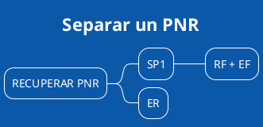

[[toc]]

# Capítulo II

En este segundo módulo vamos a crear un PNR, la forma en que "sentamos" pasajeros en los aviones.  Una especial mención merece la prohibición a cambiar nombres.  Pedir imágenes de los pasaportes para no cometer errores de nombres, suele ser una práctica muy aconsejable. 

### PNR - Campos obligatorios

En esta sección armaremos el PNR con sus campos obligatorios, sin los cuales no podemos cerrar el PNR (Passanger name record).  

|Comando Amadeus|Traducción humana|
|---|---|
|NM1WATSON/JOHN|Nombre para un solo pasajero Adulto|
|NM1FERNANDEZ/JUAN(CHD)|Nombre de un pasajero CHD|
|NM2FERNANDEZ/JUAN/MARIA(INFWATSON/ANA)|Pasajero adulto con un INF con apellido distinto|
|NM2FERNANDEZ/JOSE/ROCIO 1LOPEZ/JULIO|Dos Apellidos iguales y uno distinto|
|AP BUE +5411224422|Contacto del pasajero|
|APE-JUANPEREZ//GMAIL.COM|Contacto email del pasajero|
|RFJUAN|Firma.  Es quien solicita la reserva.|
|TKXL10FEB/1800|Tiempo Límite para emitir con cancelación automática del PNR el 10FEB a las 1800 hs.[^1]|
|8/NUEVO DATO|Para cambiar los datos del segmento 8|
|HE NAME|Manual de ayuda para el sector Nombre|
|HE AP|Manual de campo contacto|
|HE TK|Manual de campo TKT|

[^1]: Si bien es lícito utilizar TKOK o TKTL para cerrar un PNR, es una práctica aconsejada TKXL para que de manera automática, llegada esa hora y esa fecha, se cancele todo el PNR.  De esta manera evitamos cargos de la cía aérea por segmentos XX.  

#### Cambios Campo Nombre

La norma indica no cambiar nunca el cambpo nombre.  Son tantas las restricciones que es preferible no cambiar los nombres.  No tiene que estar emitido el TKT, no puede haber vuelos code share, la lista es casi infinita, por lo que conviene consultar siempre a la cía. aérea.  El comando para hacerlo es:

> NU2/1SIMPSONS/HOMER 

El 2 es el número de orden del pasajero en el PNR.  Para mas información ``HE NU``.

### Campos auxiliares del PNR

|Comando Amadeus|Traducción humana|
|---|---|
|OP10JUN|El 10 de JUN aparecerá en Cola 3 este PNR como un recordatorio.|
|OP/RECORDATORIO DE ALGO IMPORTANTE|Texto libre despuśe de la Barra hasta 256 caracteres|
|RM|Campo comentario.  Aquí podemos escribir hasta 256 caracteres por renglón y se guardan en la historia.|
|RC|Campo comentario solo la la oficina que lo crea.  No es visible en otras agencias ni cías aéreas.|
|OSLACTCE JUANPEREZ//GMAIL.COM |Osi Other Service Information, en este caso informamos el contacto del pasajero a LA la @ se escribe como //|
|SRCTCMIBHK1-5411512222/P1|Contacto telefónico del pasajero 1 para IB.|
|OSARVIP/P1|Asociamos la información a AR de uno solo de los pasajeros del PNR.|
|SRFOIDLAHK1-NI23111311|Foid, agregamos el DNI muchas Cías. aéreas solicitan el nro de docuemnto para la emisión.|
|SRFOIDLAHK1-PP23111311|Foid, agregamos el Pasaporte.|
|FHE 001-1234567890/P2|Nro de Tkt a la cía aérea.|
|SRVGML/P1-2/S6|Solicitud de Comida vegerariana para los pasajeros 1 y 2, en el segmento 6.|
|SRWCHR/P1/S3|Solicitud de Silla de ruedas para el pasajero 1 en el segmento 3.|
|SRFQTVAR-AR80434321|Pasajero frecuente de AR.|
|FFNAA-0WV3178,IB|Cargar datos del pasajero frecuente de AA en vuelos de IB|
|SRDOCS BA HK1-P-GBR-012345678-GBR-30JUN73-, M-14APR09-JOHNSON SIMON-JEAN PAUL/P1/S3|SECURE FLIGHT INFORMATION (SR DOCS)| 
|HE MEAL CODES|Ver el listado de Códigos de comidas|
|SR PSPT BA HK1-123456-BR-05MAR57-DASILVA/PAULO-M-H/P1|Iformación del pasaporte completa|
|HE SR|Manual de servicios en el PNR|
|HE OS|Manual para otros servicios de Información|

Podemos ingresar casi todos los campos separándolos con punto y coma ``";"`` en una sola entrada, por ejemplo

``NM1CHURCHILL/WINSTON 1JOHANSEN/SCARLET;AP LON 230001;TKXL10JUL;RFJOSEFINE``

### SR DOCS

Muchas Compañías Aéreas solicitan información de los pasajeros en formato **SR** (servicios auxiliares).  Nos indica al intentar cerrar el PNR con ``ET`` que falta información de email o un teléfono móvil.  El teléfono de contacto del pasajero se agrega de esta manera, suponiendo que la Cía Aérea sea ITA ``SSCTCMAZHK1-543513070654`` y el correo electrónico así ``SSCTCEAZHK1-AULAVIRTUALTURISMO@GMAIL.COM``  Si el PNR tiene varios pasajeros y queremos asignar el email individualmente, solo tenemos que agregar la asociaicón al final del renglón indicando el pasajero ``P3``.  

### Campos obligatorios para las emisiones internacionales

Si bien el PNR puede cerrarse sin los campos opcionales, para otros procesos, como por ejemplo la emisión, son muy importantes. Muchos destinos como USA, requieren agregar lo que se conoce comunmente como los ***docs***.

|Comando Amadeus|Traducción humana|
|---|---|
|FSR/CUIT2016949505/p1|CUIT O CUIL del pagador, que va a reclamar a AFIP la retención del 45% (acá puse el mío, pongan el del pax
|SRDOCS AAHK1-F-AR-AAD323332-AR-13DEC64-M-27JUL27-CENTURION/MARCOADRIAN/P1|Datos del pasajero, también puse mis datos, cámbienlos por los del pasajero

### Historia del PNR

|Comando Amadeus|Traducción humana|
|---|---|
|RH|Abrir la histora del PNR|
|RH-ALL|Ver la historia del PNR y su historia de colas|
|RHQ|Ver solamente el historial de colas del PNR|
|RHI|Ver solo los tramos del pnr|
|RHA|Ver la historia de los tramos aéreos solamente|
|RHK|Solo los elementos del/los tkts|
|RHF|Solo la sección tarifaria|
|RH/ALL|Todo el historial del pnr y su historial de colas|
|HE HISTORY|Manual de ayuda para leer la historia del PNR|

Con este comando ingresamos a todo el trazado histórico de todas las transacciones de una reserva, con el detalle de quien y en que momento realizó cada acción.

### Recuperar PNR

Ciclo de vida de un PNR.  Los PNR´s permanecen activos en Amadeus durante los cuatro (4) días posteriores a la fecha del ultimo segmento activo, luego de esto el PNR será purgado.

|Comando Amadeus|Traducción humana|
|---|---|
|RTCODIGO|Recupera un Código de reserva puntual|
|RT/FER|Trae un listado de Apellidos que empiecen con FER|
|RTCM101/20JUNCOR-FER|Recupera pasajeros de un vuelo puntual, en un aeropuerto de salida puntual cuyo apellido comience con FER.|
|RT1|Recupera el primer PNR de la lista|
|RTI|
|ET|Luego de tomar acción sobre el PNR, cierra -End of Transaction-|
|IG|Ignora todas las transacciones hechas en una reserva desde su recuperación.|
|IR|Ignora la reserva y vuelve a recuperarla para que no tengan validez las últimas acciones.|
|ER|Cierra la reserva para que apliquen los últimos cambios y la recupera nuevamente.|
|HE ET|Ayuda sobre el comando de cierre del PNR|

### Cambios

|Comando Amadeus|Traducción humana|
|---|---|
|XE2|Cancela el renglón 2, puede ser cualquier segmento del pnr, nombre, vuelo, ap, etc|
|XE4,5|Cancela estos dos sementos solamente|
|XE2-9|Cancela todo lo que exista entre 2 y 9|
|9/18JUN|Cambia la fecha que tenía -por ejemplo- el campo TL por 18JUN.|
|XI|Cancela todo el itinerario|
|SBE|Cambia todo el PNR a clase E|
|SBL2|Cambia a clase L el segmento 2|
|SB15JUL4,5|Cambia por el mismo vuelo y clases el segmento 4|

### Replicar un PNR

Cuando queremos hacer una reserva con los mismos tramos utilizamos el comando RRN y replica -de haber lugares- los mismos vuelos y clases.

|Comando Amadeus|Traducción humana|
|---|---|
|RRN|Copia todos los tramos de todos los pasajeros|
|RRN/6|Copiar ITINERARIO y cambiar número de pax a 6|
|RRN/P1,3-5|Copiar PNR de pax 1,3,4 y 5|
|RRN/S2-5,9|Copiar sólo segmentos 3,4,5 y 9|
|RRN/SX5|Copiar todos los segmentos excepto el 5.|
|RRA|Copiar los segmentos y generar un AXR|
|HE RRN|Comando de Ayuda para replicar pnrs|

---

## Separar un PNR

En muy contadas y excepcionales ocasiones vamos a separar un PNR, porque los pasajeros separan sus viajes, al menos uno de los tramos, no van a hacerlo juntos.  

**Importante**: Muchas Cías Aéreas, almacenan sus asientos en sistemas externos a amadeus y este comando para separar PNR's garantiza la integridad de los datos, SOLO para aquellas cías. que almacenan sus datos en Amadeus (Ej. LH, AF, etc.)  Nunca dividir (separar) PNRS de CM.  

El proceso consta de los siguientes pasos.

> Recuperar el **PNR**.

> Separar a los pasajeros que no requieren cambios con **SP** y los nros de los pasajeros.

> Firma con **RF** + **EF** para cerrar este primer PNR.

> Aparece el segundo PNR, a este lo **firmamos** y cerramos con **ER** y recuperamos para tomar acción del cambio.

---

### Compartir un PNR

|Comando Amadeus|Traducción humana|
|---|---|
|ESBUEG12100-B|Compartir con la OID BUEG2100 un pnr para lectura y escritura -B|
|ESBUEG12100,TUCG12100-B|Compartir con dos oficinas un pnr para lectura y escritura -B|
|ESBUEG12100-B,TUCG12100-R|Compartir con dos oficinas un pnr para escritura y lectura -B en el primero y lectura solamente en el segundo -R|
|RP/LONG12111/QTK|Pasar completamente el control del pnr a otra oficina|

---

## Itinerario

Podemos enviar un itinerario por Email al correo que pusimos en el campo ``APEcorreo@gmail.com``

|Comando Amadeus|Traducción humana|
|---|---|
|IPEJ|Imprime el itinerario para todos los pasajeros|
|IEPJ/P2|Solo imprime el itinerario del pasajero 2|
|IEP-EML-homerosimpsons@gmail.com | Envía el itinerario al email del pasajero|
|IEP-EML|Envía el itinerario por email al correo que está detallado en el campo APE|
|RMZ/CONF\*FORMAT:PDF|Al enviar por email el itinerario solo sale en formato PDF|
|HE IEPJ|Help para Itinerario|

---

[Amadeus Selling Connect Producción](https://www.sellingplatformconnect.amadeus.com/) | [DESCARGA material de apoyo](https://thconsultora.com.ar/contactus) | [Amadeus Selling Platform Training](https://www.training.sellingplatformconnect.amadeus.com)

#### Redes Sociales

[Github](github.com/marcocenturion) | [Twitter](https://twitter.com/@aulavirtuaturis) | [LinkedIn](https://www.linkedin.com/marco-adrian-centurion) | [Youtube](https://www.youtube.com/channel/UCsJpj4sGM4oMU0vkbDVdHFQ)

---

@startuml
!theme amiga
component comp1 [
T H Consultora
==
www.thconsultora.com.ar
Tel/Whats: +543513070654
Email: marco@thconsultora.com.ar 
--
]
@enduml

