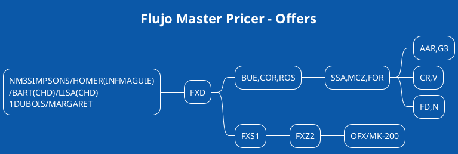
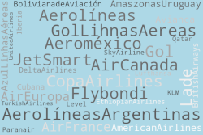
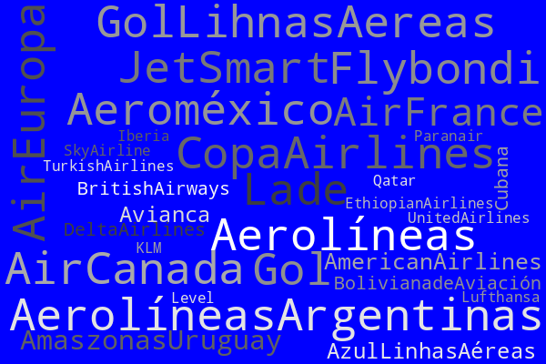

[[toc]]

### Capítulo IV

Este cuarto módulo enfocado en mejorar la experiencia del usuario que busca vuelos, unificando las taréas de búsqueda de disponibilidad y tarifa en una sola acción.  Un pasajero accede a miles de sitios on line con las mejores tarifas.  Comprará en una agencia minorista al público, incluso pagando unos pocos pesos mas, solo por la seguridad que le brinda tener un local físico, pero no podemos demorarle la respuesta a su pedido mas de un día.

> La eficacia difiere de la eficiencia en el sentido que la **eficiencia** hace referencia a la **mejor utilización de los recursos**, en tanto, la eficacia hace referencia en la capacidad para alcanzar un objetivo sin importar si se le ha dado el mejor uso a los recursos

Podemos buscar una tarifa y disponibilidad por separado, recorrer varios puntos de origen y destino, con distintas cías. aéreas y clases.  Pero podemos hacer un mejor uso de los recursos y utilizar MasterPricer.  En pocos segundos obtenemos respuestas que podrían habernos llevado horas.  Una segunda herramienta es Offers, donde dejamos muchas rutas guardadas sin reservar y enviamos al cliente información muy detallada para que sea el quien lo elija.

### Master Pricer

En esta sección veremos los conceptos mas importantes de la herramienta de pago Master Pricer.  No viene incluida en la configuración standard de Amadeus por defecto, sino que es necesario solicitarla al Ejecutivo de cuenta, ya que es con cargo.

Master Pricer unifica la búsqueda de tarifa y disponibilidad a un solo comando.

De esta manera podemos agregar filtros para que el resultado sea lo mas parecido a la necesidad del pasajero.  Por otra parte, podemos ampliar la búsqueda para agregar mas de un punto de salida o mas de un punto de llegada.

|Comando Amadeus|Traducción humana|
|---|---|
|FXD **2** ROM/D10AUGMIA/D20AUGROM|Búsqueda simple, 2 pasajeros ROM MIA ROM sin filtros|
|FXD BUE/D10AUG/**FD**MIA/D20AUGBUE|**FD** Solo vuelos directos de BUE a MIA, en caso de no indicar la cantidad de pasajeros, asume uno.  A exepción de tener un PNR iniciado con Nombres|
|FXD SCL/D10AUG**FD,N**MIA/D20AUGSCL|Solo vuelos directos y sin escalas entre SCL y MIA|
|FXD COR/D10AUG/FD0900MIA/D20AUG/FA1200COR|Salida a las 0900 de COR y Arribo a las 1200 a COR|
|FXD COR/D10AUGMIA--NYC/D20AUGCOR|Un tramo de superficie se indica con doble guion - - entre MIA y NYC|
|FXD COR/D10AUGMIA/D20AUGCOR/**R,NPE**|Solamente que muestre Tarifas Sin PENALIDAD RF=Reembolsables NAP=sin AP|
|FXD COR/D10AUGMIA/D20AUGCOR/**KC**|Solo ofertas en cabina Ejecutiva|
|FXD COR/D10AUGMIA/D20AUGCOR//KC,F|Dos cabinas distintas Ejecutiva y First, por defecto asume que las  busquedas deben ser en Economy KW = Economy premium|
|FXD COR,BUE,MDZ/D10AUGMIA/D20AUGCOR,MDZ,BUE|Saliendo de 3 posibles aeropuertos de origen (Comando ideal para agencias con pasajeros (por EJ) de LA  PAMPA)|
|FXD COR/D10AUG CUN,PUJ,SDQ/D20AUGCOR|idem + Aeropuertos de destino (Vacacional que busca CUN, pero  que podemos ganar la venta por ofrecerle un destino de playa similar):|
|FXD COR/D10AUGCUN,PUJ,SDQ/D20AUGCOR/A-AR|La misma ruta anterior, pero esta vez excluyendo AR, para excluir  la CIA A-AR Se pueden incluir hasta 3 cías AAR,UX,IB|
|FXD COR/D10AUGMIA,FLL,TPA/D20AUGCOR//A*A|La ruta mas barata a cualquiera de estos 3 destinos, con A*A =StarAlliance, A*O=OneWorld, A*S =SkyTeam|
|FXD COR/D10AUGBPS,SSA,NAT/D20AUGCOR/R,UP,UARBR00,UAZUL,U*OPERINT|La mejor tarifa a cualquiera de estos 3 destinos, NAT BPS ó SSA  incluyendo netas, publicas, nego G3, nego JJ y nego AD|
|FXD COR,BUE,ROS/D10AUGBPS,SSA,NAT/ D20AUGCOR,ROS,BUE/R,UP,UARBR00,U\*AZUL,U\*OPERINT5|IMPRESIONANTE: La mejor tarifa a cualquiera de estos 3  destinos, NAT BPS ó SSA incluyendo 1) netas, 2) publicas, 3) nego  G3, 4) nego JJ y 5) nego AD, saliendo de BUE ROS o COR|
|FXD COR/D10AUGPUJ,SDQ,HAV/ D20AUGCOR/RPFA,U*ARVPU,UP|La mas barata a PUJ SDQ o HAV publicas, netas y nego CM |
|FXD COR/D10AUGTRN/**DI-120K**/D20AUGCOR|Radio de 120 KM alrededor de un aeropuerto, en este caso TRN |

#### Respuesta de Master Pricer

```21 GROUPS AND 50 RECOMMENDATIONS RETURNED FROM EUR 69.85 TO 3253.54                                                                                        

---------- RECOMMENDATION 1 OF 4 IN GROUP 1 (EUR 69.85)----------               
  PTC       CUR                 TAX           FARE BASIS                        
1 ADT     1 EUR     69.85     48.85           ZFLY5L                            
  TOTAL   1 EUR     69.85     48.85                                                                                                                        
1   UX1029  Z  15JAN  MAD 2 ORY 3  1420  1620   E0/73H  0200                    
2   UX1028  Z  20JAN  ORY 3 MAD 2  1015  1215   E0/73H  0200                    
>> FXS1 TO SELECT  >> FXZ1 TO BOOK  >> FXU1 TO BOOK AND CREATE TST              
>> FXY1 TO HAVE UPSELL RECOMMENDATION                                           
1 TICKETS ARE NON-REFUNDABLE                                                    
1 LAST TKT DTE23SEP20 - SEE ADV PURCHASE                                        
FARE FAMILIES:    (FOR MORE DETAILS: FQFn)                                      
FARE FAMILY:FC1:1:LITE                                                          
FARE FAMILY:FC2:2:LITE                                                                                                                                

---------- RECOMMENDATION 1 OF 1 IN GROUP 2 (EUR 87.80)----------               
  PTC       CUR                 TAX           FARE BASIS                        
1 ADT     1 EUR     87.80      0.00           ABATO                             
  TOTAL   1 EUR     87.80                                                      
1   TO3187  A  15JAN  MAD 2 ORY 3  1740  1945   L0-73H  0205                    
2   TO3186  A  20JAN  ORY 3 MAD 2  1450  1655   T0-73H  0205                    
>> FXS2 TO SELECT  >> FXZ2 TO BOOK  >> FXU2 TO BOOK AND CREATE TST              
>> FXY2 TO HAVE UPSELL RECOMMENDATION                                           
FARE FAMILIES:    (FOR MORE DETAILS: FQFn)                                      
FARE FAMILY:FC1:1:BASIC                                                         
FARE FAMILY:FC2:2:BASIC                                                                                                                                     

---------- RECOMMENDATION 1 OF 4 IN GROUP 3 (EUR 89.85)----------               
  PTC       CUR                 TAX           FARE BASIS                        
1 ADT     1 EUR     89.85     48.85           AFLY5L+ZFLY5L                     
  TOTAL   1 EUR     89.85     48.85                                                                                                        
1   UX1027  A  15JAN  MAD 2 ORY 3  0715  0915   E0/73H  0200                    
2   UX1028  Z  20JAN  ORY 3 MAD 2  1015  1215   E0/73H  0200                    
>> FXS3 TO SELECT  >> FXZ3 TO BOOK  >> FXU3 TO BOOK AND CREATE TST              
>> FXY3 TO HAVE UPSELL RECOMMENDATION                                           
1 TICKETS ARE NON-REFUNDABLE                                                    
1 LAST TKT DTE23SEP20 - SEE ADV PURCHASE                                        
FARE FAMILIES:    (FOR MORE DETAILS: FQFn)                                      
FARE FAMILY:FC1:1:LITE                                                                                                                              
FARE FAMILY:FC2:2:LITE                                                                                                                            

---------- RECOMMENDATION 1 OF 3 IN GROUP 4 (EUR 95.85)----------               
  PTC       CUR                 TAX           FARE BASIS                        
1 ADT     1 EUR     95.85     48.85           AON3ANB4                          
  TOTAL   1 EUR     95.85     48.85                                             
1   IB3406  A  15JAN  MAD 4 ORY 4  1130  1335   E0/320  0205                    
2   IB3417  A  20JAN  ORY 4 MAD 4  0730  0935   E0/321  0205                    
>> FXS4 TO SELECT  >> FXZ4 TO BOOK  >> FXU4 TO BOOK AND CREATE TST              
>> FXY4 TO HAVE UPSELL RECOMMENDATION                                           
1 TICKETS ARE NON-REFUNDABLE                                                    
1 LAST TKT DTE23SEP20 - SEE ADV PURCHASE                                        
1 FARE VALID FOR E TICKET ONLY                                                  
FARE FAMILIES:    (FOR MORE DETAILS: FQFn)                                      
FARE FAMILY:FC1:1:NOBAG                                                         
FARE FAMILY:FC2:2:NOBAG
```
----

### Ejemplos de búsquedas y su explicación

Cuatro pasajeros, pueden salir desde BUE o MVD a algún destino de Playa en el Caribe, con LA. ```FXD4BUE,MVD/D20JULPUJ,CUN,HAV/D29JULBUE,MVD/ALA```

La misma búsqueda pero ahora que muestre cualquier ruta que no sea con CM ```FXD4BUE,MVD/D20JULPUJ,CUN,HAV/D29JULBUE,MVD/A-CM```

Dos pasajeros quieren viajar a TRN desde BUE ```FXD2BUE/D22AUGTRN/DI-120K/D20SEPBUE``` Buscamos aeropuertos alrededor de 120 km. de TRN, incluso este.

### Acciones posteriores a FXD

Para entrar a ver cada una de las recomendaciones del grupo 4, porque supongamos que solo queremos ver las tarifas y disponibilidades de IB, debemos hacer ```FXS4``` de ese listado vamos a seleccionar la segunda opción con ```FXZ4```.   

|Comando Amadeus|Traducción humana|
|---|---|
|FXS1|Ver las recomendaciones dentro del primer grupo |
|FXZ3|Seleccionar la recomendación 3 |

## Offers

Para crear una oferta, debemos seleccionar el itinerario y NO CERRARLO, no confirmar los lugares.  Una vez que tenemos todo el itinerario completo, cotizamos la ruta con ```FXX``` para que quede la máscara.  Con la máscara creada podemos pasar esa ruta a una Oferta con ```OFS```.  Podemos agregar el fee de nuestra venta agregando MK- y el importe total para toda la venta de nuestro fee, **en la misma moneda** que fue creado el TST. 

Enviamos por email la oferta, donde constará un precio total por toda la operación, una nota aclaratoria al pasajero que no se trata de una reserva, la franquicia de equipaje en cada una de las propuestas -si hay mas de una- y el detalle completo del itinerario en un formato amigable al pasajero.

Al no estar confirmados los lugares, no hay lugar a malas prácticas y podemos enviarles tantas propuestas de viaje como imaginemos.  Ida un día antes y uno despues, varias cías aéreas distintas, con o sin equipaje, etc.

Cuando el pasajero decide cual de las propuestas le satisface, convertimos la oferta en una reserva con ```OFK2``` si los lugares están disponibles queda el itinerario armado, para agregar los campos NM, AP, TK, RF y cerrarlo.  Si no hay lugares, aparece un mensaje con la opción mas parecida en precio.

|Comando Amadeus|Traducción humana|
|---|---|
|OFS/MK-100|Convertir la ruta en una Oferta (no tiene que haberse cerrado el  PNR) agregándole un markup de 100 en la moneda que se cotizó| 
|OFN-EMLaulavirtualturismo@gmail.com|Enviar las ofertas por Email del cliente|
|RTOF |Ver las ofertas dentro de un PNR de solo ofertas| 
|OFK2|Confirmar la Oferta 2| 

## Flujo Ideal



---

URL Amadeus Connect
https://www.sellingplatformconnect.amadeus.com/

DESCARGA material de apoyo:
https://thconsultora.com.ar/ - Sección "Contáctenos" 

Redes Sociales
Github: github.com/marcocenturion

Twitter: https://twitter.com/@aulavirtuaturis

LinkedIn: https://www.linkedin.com/marco-adrian-centurion

Youtube: https://www.youtube.com/channel/UCsJpj4sGM4oMU0vkbDVdHFQ

## Contáctenos:

Para mayor información sobre cursos, noticias y más
http://thconsultora.com.ar/blog






@startuml
!theme amiga
component comp1 [
T H Consultora
==
www.thconsultora.com.ar
Tel/Whats: +543513070654
Email: marco@thconsultora.com.ar 
--
]
@enduml
