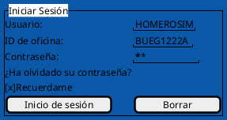
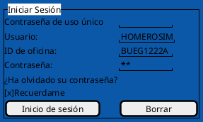

[[toc]]

### Introducción a Amadeus

Felicitaciones por inscribirte a nuestro curso de **Introducción a Amadeus**.  Bienvenido/a.  Vamos a respetar un tiempo de aprendizaje de los conceptos que son muchas veces repetitivos y tediosos.  A lo largo del curso vamos a ir construyendo este conocimiento, viendo el máximo beneficio que podemos obtener del sistema, utilizando todo su potencial.  

Va a ser muy bueno repasarlos, por simples y sabidos que suenen, ya que verlos nuevamente, revisarlos, puede ayudarnos a acortar procesos repetitivos, o encontrar nuevas funcionalidades.

En este breve curso veremos los conceptos básicos para que desde cero, el usuario pueda familiarizarse con el GDS Amadeus en formato críptico.  Recomendamos la lectura detallada de los manuales y utilizar el sistema en modo **Training** para evitar generar reservas fantasma, que son penalizadas por las Cías. Aéreas.

El primer canal de soporte va a ser el **Foro**, que estará disponible en el menú del sitio.  Las respuestas estarán dentro de las 48hs.  La recomendación, es que dentro de los cursos programados, los pares respondan las inquietudes del foro, para cumplir la premisa de Glesser.  El mejor aprendizaje, se da entre pares.

Unas mínimas y simples reglas de conducta, que parecen obvias pero que es bueno aclararlas al principio.

> No escribir en Mayúsculas.  PARECE QUE ESTAS GRITANDO.

> Se cortes y agradecido con tus compañeros, como también generoso con tu conocimiento.

> No agregues demasiados signos o leeeeeetras repetidaaaaaaaas!!!! Ni sígnos raros que parecen palabrotas =·##??=$&&""!


------

```chart
{
  "type": "pie",
  "data": {
    "labels": [
      "Leer",
      "Escuchar",
      "Mirar",
      "Ver, Oir",
      "Hablar, Preguntar, Repetir",
      "Hacer",
      "Enseñar"
    ],
    "datasets": [
      {
        "data": [
          1,
          2,
	  4,
	  8,
	  16,
	  32,
	  64          
        ],
        "backgroundColor": [
          "#FF6384",
          "#36A2EB",
          "#FFCE56",
          "#F88C56",
          "#2FCE56",
          "#B9C5B6",
          "#EF3CE6"
        ],
        "hoverBackgroundColor": [
          "#FF6384",
          "#36A2EB",
          "#FFCE56",
          "#F88C56",
          "#2FCE56",
          "#B9CE56",
          "#EFCE56"
        ]
      }
    ]
  },
  "options": {}
}
```

---

### Metodología del curso.

Necesitamos de un compromiso de parte de los asistentes. 

- Mirar los videos, incluso los que están en Inglés, leer los manuales y practicar en Amadeus **SIN CERRAR** los pnrs.

- Si alguien tiene una consulta, revisar en el foro, porque muchas veces esa inquietud ya está respondida.  En caso de no encontrar respuesta en el foro, dejarla por escrito lo mas detallado posible.  El solo hecho de formular la pregunta, nos ayuda a armar nuestro **Mapa Mental**.  

- Responder en el foro es una de las maneras en que mejor construimos el conocimiento.  No solo es gratificante compartir la Info, además de mejorar los conceptos, nunca aprendemos mas que en el momento de enseñar a otros.  

- Dentro de las 48 hs. de hecha la consulta, vamos a responderla de todas formas.

- No temas preguntar, no existen preguntas inútiles.  

> "Todos somos ignorantes, solo que ignoramos cosas distintas"  -- Albert Einstein. 

### Manual de Reservas

Recomiendo bajar el Manual de reservas que está en esta sección y seguir este plan de lectura.  Practicar los comandos en modo Training ``TRN``.  Lo importante no es memorizar todos los comandos y filtros, algo que es imposible, sino saber que existen refinamientos a cada comando, cada búsqueda tiene parámetros que hacen que la respuesta sera mucho mas adecuada a nuestras necesidades, aliviándonos de leer páginas y páginas, en la consola de Amadeus.  Todos los comandos tienen una documentación muy complenta en el sistema, al que accedemos indicando Help y el comando o palabra clave.  ``HE comando`` 

----

#### Indice del Manual de Amadeus

|Título|Contenido|
|---|---|
|Codificación y Decodificación|Pag. 19 a 25|
|Conversiones|Pag. 29 y 30|
|Help|Pag. 31 y 32|
|Disponibilidad y tablas de horario|Pag. 37 a 55|
|PNR|Pag. 56 a 99|
|FQD|Pag. 102 a 117|
|Colas|Pag. 119 a 126|


### Contenido del curso

|Título|Contenido|
|---|---|
|Codificiación y Decodificacion (ciudades, aeropuertos, cías aéreas, etc)|Este es el *[Capítulo I](https://github.com/MarcoCenturion/Linux/blob/main/Amadeus/Capitulo_I.md)*|
|Coversiones|Este es el *[Capítulo I](https://github.com/MarcoCenturion/Linux/blob/main/Amadeus/Capitulo_I.md)*|
|Frecuencias de vuelos entre ciudades.  **(TA, TD, TN)**|Este es el *[Capítulo I](https://github.com/MarcoCenturion/Linux/blob/main/Amadeus/Capitulo_I.md)*|
|Disponibilidad por pares de ciudades.  **(AA, AD, AN)**|Este es el *[Capítulo I](https://github.com/MarcoCenturion/Linux/blob/main/Amadeus/Capitulo_I.md)*|
|Refinamiento de la búsqueda.  (conexiones, cias, alianzas, clases, etc)|Este es el *[Capítulo I](https://github.com/MarcoCenturion/Linux/blob/main/Amadeus/Capitulo_I.md)*|
|Vuelos, tarifas y armado de una reserva|Este es el *[Capítulo I](https://github.com/MarcoCenturion/Linux/blob/main/Amadeus/Capitulo_I.md)*|
|PNR |Este es el *[Capítulo II](https://github.com/MarcoCenturion/Linux/blob/main/Amadeus/Capitulo_II.md)*|
|Campos obligatorios **(NM, AP, TK, RF, itinerario)**|Este es el *[Capítulo II](https://github.com/MarcoCenturion/Linux/blob/main/Amadeus/Capitulo_II.md)*|
|Campos opcionales **(SR, OS)**|Este es el *[Capítulo II](https://github.com/MarcoCenturion/Linux/blob/main/Amadeus/Capitulo_II.md)*|
|Breve introducción a tarifas|Este es el *[Capítulo III](https://github.com/MarcoCenturion/Linux/blob/main/Amadeus/Capitulo_III.md)*|
|Colas|Este es el *[Capítulo III](https://github.com/MarcoCenturion/Linux/blob/main/Amadeus/Capitulo_III.md)*|
|MasterPricer **(FXD)**|Este es el *[Capítulo IV](https://github.com/MarcoCenturion/Linux/blob/main/Amadeus/Capitulo_IV.md)*|
|Offers **(OFS)**|Este es el *[Capítulo IV](https://github.com/MarcoCenturion/Linux/blob/main/Amadeus/Capitulo_IV.md)*|
|Glosario de Términos|Este es el *[Capítulo V](https://github.com/MarcoCenturion/Linux/blob/main/Amadeus/Capitulo_V.md)*|

Aprenderemos los diferentes comandos, los parámetros de esos comandos, el sistema de ayuda que tiene incluido Amadeus en su modo críptico.

---

### Buenas Prácticas

Nunca está de mas repetir ciertos usos y costumbres recomendados para el correcto uso del sistema, que nos evitarán dolores de cabeza en el uso cotidiano.

> Solicitar toda la documentación al pasajero **antes** de hacer el **PNR**.  Validarla.  Esto nos permite hacer la reserva con los nombres correctos.  Toda corrección posterior tiene costos, que por regla general, termina pagando la agencia.

> No dividas los **PNRS** de cías que no almacenan sus asientos en Amadeus.  COPA concretamente.  Dividir los PNRS solo en casos extremos.  Hecha la división, corroborar con la cía que vea la reserva en sus sistema.

> No generes segmentos fantasma en el sistema, las cías aéreas lo penalizan.

> No generes ocupación ficticia.

> No uses nombres ficticios en los PNRS, las cías aéreas lo penalizan.  Nunca, por mucho que después los canceles.  Los PNRS generados en producción con nombres ficticios siempre son penalizados por las cías. aéreas.

> Para práctica utilizá el modo Training, accediendo al link de [Amadeus Selling Platform Training](https://www.training.sellingplatformconnect.amadeus.com)

> No genere duplicidades de segmentos o de PNRS.

> Prestar atención al Tiempo mínimo de conexión.

> Mantener todo el itinerario en un mismo PNR.

> Chequear colas todos los días.

> No cambies los nombres en los PNRS.

> Los segmentos LK y TK son garantizados por el GDS.

> Agregue en un OSI el contacto del pasajero y de la agencia, para seguimiento y cancelaciones.  Le resuelve muchos problemas al pasajero en su viaje.

> El campo RF es para que indique quien es la persona que le pidió a ud. la reserva, si indica PAX no da mucha información a los diez meses, al intentar buscar en la historia.

### Ingreso al Sistema

Amadeus Selling Platform es una app que corre exclusivamente en la nube, el agente no debe instalar ningún software.  Para ingresar se necesita.


---

Para ingresar por primera vez desde un dispositivo nuevo o desde un navegador nuevo (Firefox, Chrome, Safari, Edge, Etc.) El sistema requiere un doble factor de autenticación.  Esto significa que una ves que el usuario ingresa a https://www.sellingplatformconnect.amadeus.com/ el sistema va a enviarle un email con un token de seis dígitos, muy parecido a un código de reservas.  Ese Token lo va a soliciatar solamente una vez, siempre y cuando sigamos ingresando a través del mismo navegador y la misma PC.  Cada vez que cambiemos de lugar de ingreso, la primera vez que entremos, nos va a solicitar ese token. 

La vista de ingreso al sistema va a agregar un renglón mas con la leyenda ``Contraseña de uso único`` ese es el token que va a llegar por email, de seis dígitos.


---

[Amadeus Selling Connect Producción](https://www.sellingplatformconnect.amadeus.com/) | [DESCARGA material de apoyo](https://thconsultora.com.ar/contactus) | [Amadeus Selling Platform Training](https://www.training.sellingplatformconnect.amadeus.com)

#### Redes Sociales

[Github](github.com/marcocenturion) | [Twitter](https://twitter.com/@aulavirtuaturis) | [LinkedIn](https://www.linkedin.com/marco-adrian-centurion) | [Youtube](https://www.youtube.com/channel/UCsJpj4sGM4oMU0vkbDVdHFQ)

---


@startuml
!theme amiga
component comp1 [
T H Consultora
==
www.thconsultora.com.ar
Tel/Whats: +543513070654
Email: marco@thconsultora.com.ar 
--
]
@enduml
