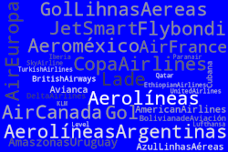

### Introducción a Amadeus

[[toc]]

En este breve curso veremos los conceptos básicos para que desde cero, el usuario pueda familiarizarse con el GDS Amadeus en formato críptico.  Recomendamos la lectura detallada de los manuales y utilizar el sistema en modo Training para evitar generar reservas fantasma, que son penalizadas por las Cías. Aéreas.

Recomiendo bajar el Manual de reservas que está en esta sección y seguir este plan de lectura.


|Título|Contenido|
|---|---|
|Codificación y Decodificación|Pag. 19 a 25|
|Conversiones|Pag. 29 y 30|
|Help|Pag. 31 y 32|
|Disponibilidad y tablas de horario|Pag. 37 a 55|
|PNR|Pag. 56 a 99|
|FQD|Pag. 102 a 117|
|Colas|Pag. 119 a 126|


### Contenido

|Título|Contenido|
|---|---|
|Codificiación y Decodificacion (ciudades, aeropuertos, cías aéreas, etc)|Este es el *[Capítulo I](https://www.markdownguide.org)*|
|Coversiones|Este es el *[Capítulo I](https://www.markdownguide.org)*|Este es el *[Capítulo I](https://www.markdownguide.org)|*
|Frecuencias de vuelos entre ciudades.  **(TA, TD, TN)**|Este es el *[Capítulo I](https://www.markdownguide.org)*|
|Disponibilidad por pares de ciudades.  **(AA, AD, AN)**|Este es el *[Capítulo I](https://www.markdownguide.org)*|
|Refinamiento de la búsqueda.  (conexiones, cias, alianzas, clases, etc)|Este es el *[Capítulo I](https://www.markdownguide.org)*|
|Vuelos, tarifas y armado de una reserva|Este es el *[Capítulo I](https://www.markdownguide.org)*|
|PNR |Este es el *[Capítulo II](https://www.markdownguide.org)*|
|Campos Obligatorios **(NM, AP, TK, RF, itinerario)**|Este es el *[Capítulo I](https://www.markdownguide.org)*|
|Campos opcionales **(SR, OS)**|Este es el *[Capítulo III](https://www.markdownguide.org)*|
|Breve introducción a tarifas|Este es el *[Capítulo IV](https://www.markdownguide.org)*|
|MasterPricer **(FXD)**|Este es el *[Capítulo IV](https://www.markdownguide.org)*|
|Offers **(OFS)**|Este es el *[Capítulo IV](https://www.markdownguide.org)*|
|Help|Este es el *[Capítulo V](https://www.markdownguide.org)*|
|Colas|Este es el *[Capítulo V](https://www.markdownguide.org)*|
|Glosario de términos|Este es el *[Capítulo VI](https://www.markdownguide.org)*|

Aprenderemos los diferentes comandos, los parámetros de esos comandos, el sistema de ayuda que tiene incluido Amadeus en su modo críptico.

### Buenas Prácticas

> Solicitar toda la documentación al pasajero ANTES de hacer el PNR.  Esto nos permite hacer la reserva con los nombres correctos.  Toda corrección posterior tiene costos, que por lo general paga la agencia.

> No divida los PNRS de cías que no almacenan sus asientos en Amadeus.  Dividir los PNRS solo en casos extremos.

> No genere segmentos fantasma en el sistema, las cías lo penalizan.

> No genere ocupación ficticia.

> No use nombres ficticios en los PNRS.

> Para práctica utilice el modo Training.

> No genere duplicidades de segmentos o de PNRS.

> Prestar atención al Tiempo mínimo de conexión.

> Mantenga todo el itinerario en un mismo PNR.

> Chequear colas todos los días.

> No cambie los nombres en los PNRS.

> Los segmentos LK y TK son garantizados por el GDS.

> Agregue en un OSI el contacto del pasajero y de la agencia, para seguimiento y cancelaciones.  Le resuelve muchos problemas al pasajero en su viaje.

> El campo RF es para que indique quien es la persona que le pidió a ud. la reserva, si indica PAX no da mucha información a los diez meses, al intentar buscar en la historia.

---


URL Amadeus Connect
https://www.sellingplatformconnect.amadeus.com/

DESCARGA material de apoyo:
https://thconsultora.com.ar/ - Sección "Contáctenos" 

Redes Sociales
Github: github.com/marcocenturion

Twitter: https://twitter.com/@aulavirtuaturis

LinkedIn: https://www.linkedin.com/marco-adrian-centurion

Youtube: https://www.youtube.com/channel/UCsJpj4sGM4oMU0vkbDVdHFQ

### Contáctenos:

```json
{
  "firstName": "Marco Adrián",
  "lastName": "Centurión",
  "Email": "aulavirtualturismo@gmail.com",
  "Tel/Whats": "+543513070654",
  "Web": "https://thconsultora.com.ar"
}
```
Para mayor información sobre cursos, noticias y más
http://thconsultora.com.ar 
http://thconsultora.com.ar/blog




