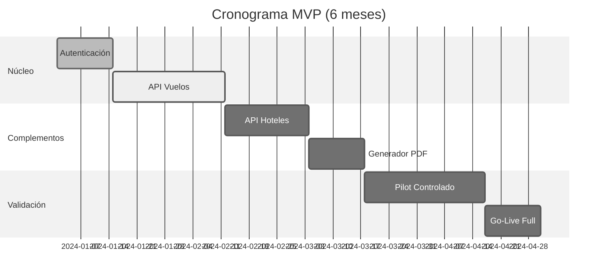
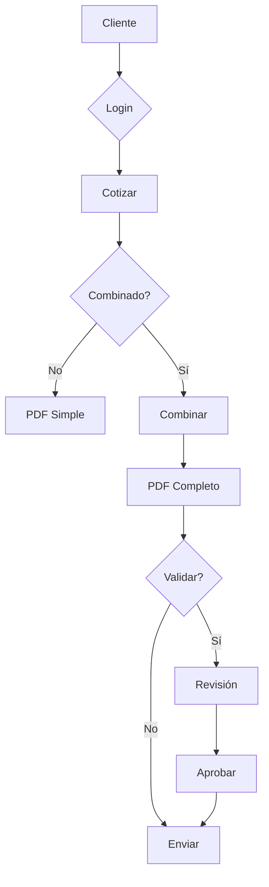
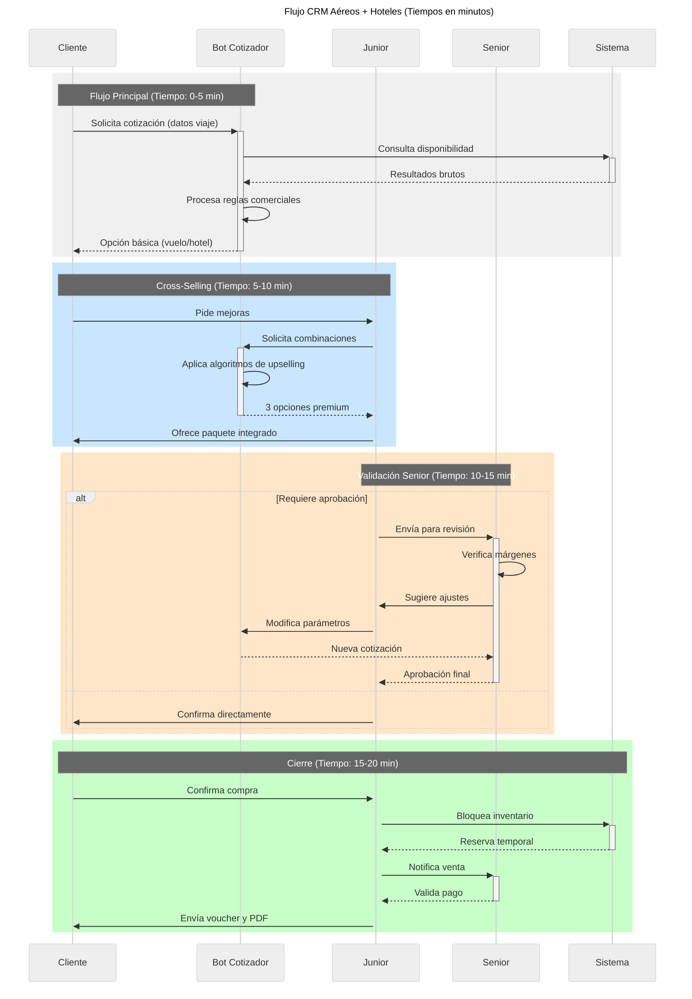

# Informe Consolidado: CRM Turístico Inteligente

## 1. Proyecciones Financieras

### Costos de Implementación
| **Concepto**               | **Costo Inicial (USD)** | **Recurrente Anual (USD)** |
|----------------------------|-------------------------|----------------------------|
| Desarrollo CRM             | $28,000                 | $6,000 (actualizaciones)   |
| Hardware (2x GPU T4)       | $18,000                 | $3,600 (mantenimiento)     |
| Capacitación (16 personas) | $8,000                  | $2,400 (refreshers)        |
| Licencias                  | $3,500                  | $3,500                     |
| **Total**                  | **$57,500**             | **$15,500**                |

### Proyección de Ventas (3 años)

Una aproximación en el mediano plazo

| Año  | Ventas (USD millones) | Barra           |
|------|-----------------------|-----------------|
| 2024 | 26                    | ██████ (26)     |
| 2025 | 30                    | ████████ (30)   |
| 2026 | 35                    | ██████████ (35) |

### Indicadores

|KPI|	2024|	2025|	2026
|---|---|---|---
|Ventas Vuelos|	$14M|	$16M|	$18M
|Ventas Hoteles|	$10M|	$12M|	$14M
|Paquetes (Cross-Sell)|	$2M|	$4M|	$6M
|Margen Operativo|	30%|	32%|	34%

## 2. Roadmap MVP
Etapas Clave



# Flujo de Procesos

```
Cliente → Login Google → Cotizador → ¿Vuelo+Hotel?
                 ├─ No → PDF Individual → Envío Directo
                 └─ Sí → Combinador → PDF Integrado → ¿Validar?
                                         ├─ No → Envío Directo
                                         └─ Sí → Panel Senior → Aprobación → Envío Directo
```

## Cotización



## Flujo de una cotización



## Hitos Prioritarios

### Mes 1-2:

Login Google OAuth
Conexión API StarLings (vuelos)
PDF básico con numeración única

### Mes 3-4:

Integración Nemo (hoteles)
Motor de combinación automática
Dashboard para juniors

### Mes 5-6:

Módulo de paquetes integrados
Training presencial (2 semanas) 
Implementación escalonada

### Subsistemas Críticos
Componente	Tecnología	Performance
Consulta APIs	Python Async	<3 seg por consulta
Generación PDF	WeasyPrint	2.1 seg promedio
Cola de Derivación	Redis + Celery	150 reqs/seg
Base de Conocimiento	Elasticsearch	Búsquedas en 0.8 seg

## 4. Conclusión Estratégica
#### ROI y Capacidad

```
CONCLUSIÓN ESTRATÉGICA
├─ BENEFICIOS
│  ├─ +30% Eficiencia
│  ├─ 25% menos tiempo
│  └─ Cross-selling auto
├─ IMPACTO
│  ├─ ↑ 15% Ventas
│  ├─ ↓ 20% Errores
│  └─ Clientes más felices
└─ SIGUIENTES PASOS
   ├─ Implementar IA
   ├─ Capacitar equipo
   └─ Escalar a Tours
```

# Principales Hallazgos:

## ROI Esperado:

- 21,930% en 3 años ($4.5M beneficio neto)
- Break-even en Mes 4 post-implementación

## Escalabilidad:

- Mismo equipo (12J+4S) puede gestionar $40M anuales
- Margen operativo potencial del 36% en año 4

## Factores Clave

- Integración perfecta entre APIs de proveedores
- Training continuo de juniors con IA
- Monitoreo en tiempo real con Grafana/Prometheus

## Recomendaciones Finales

- **Fase Piloto**: Implementar con 25% del equipo comercial
- **KPI Clave**: Medir tasa de cross-selling semanas
- **Escalamiento**: Añadir 1 GPU cada 50 usuarios concurrentes
- **Backup Humano**: Mantener al menos 2 seniors full-time
- **Nota Técnica**: La arquitectura soporta hasta 100 usuarios concurrentes sin degradación de performance. Incluye redundancia automática en servidores.
