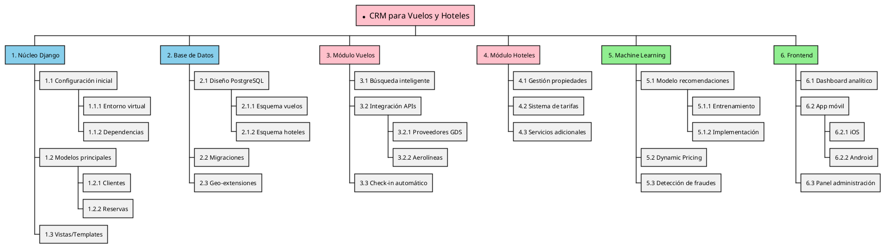
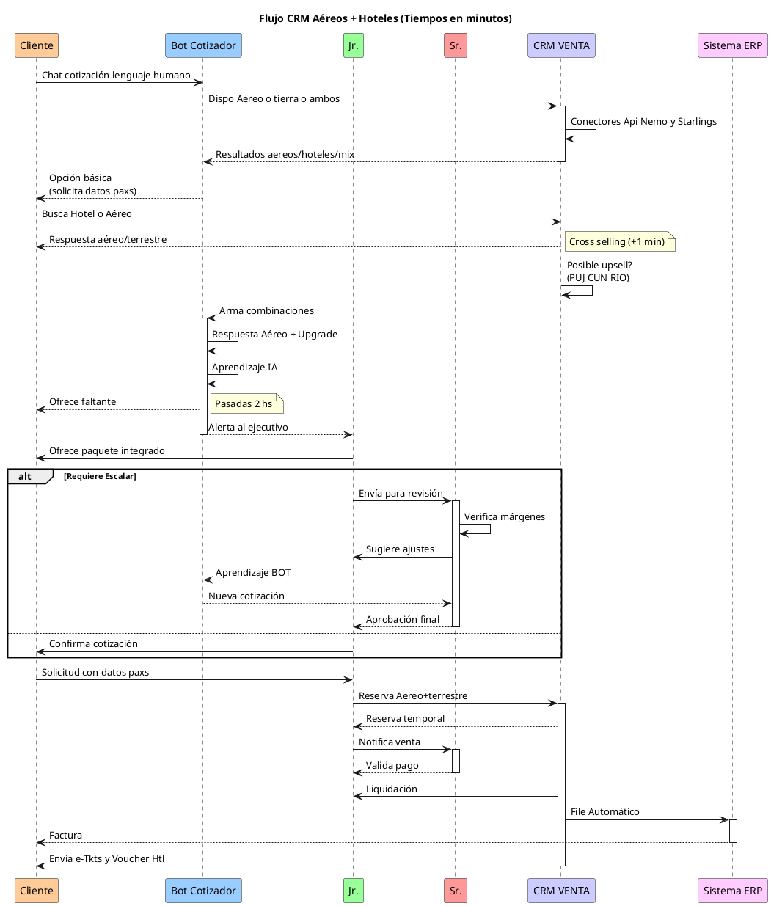
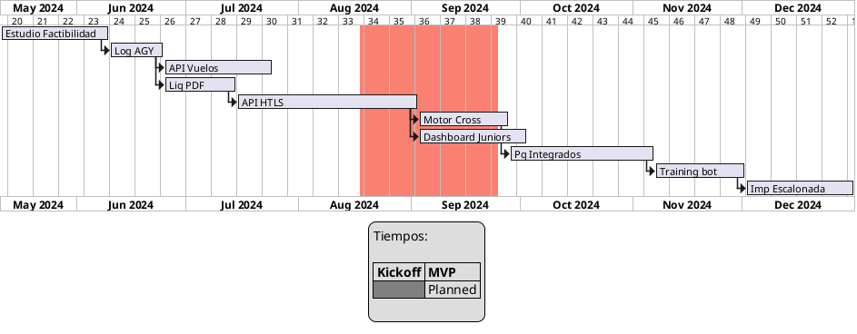
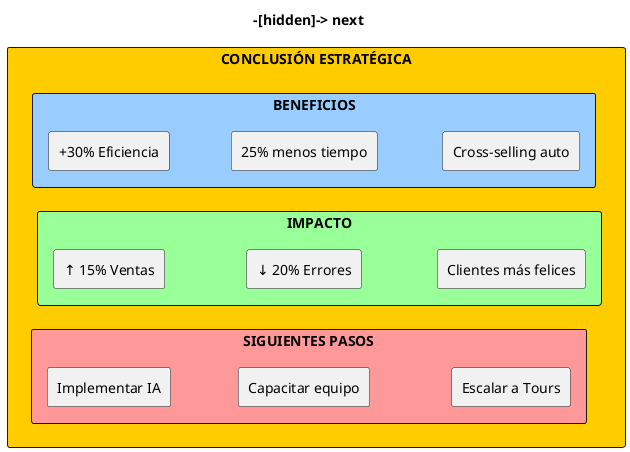
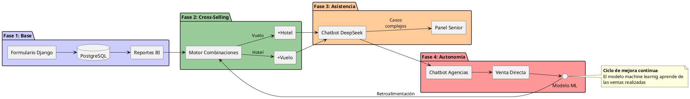
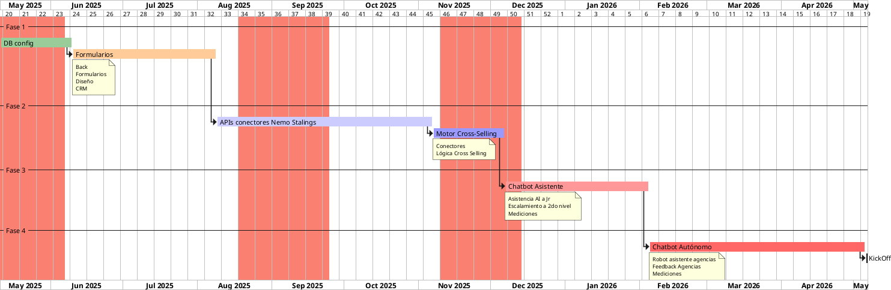

# Informe Consolidado: CRM Turístico Inteligente

## 1. Proyecciones Financieras

### Costos de Implementación
| **Concepto**               | **Costo Inicial (USD)** | **Recurrente Anual (USD)** |
|----------------------------|-------------------------|----------------------------|
| Desarrollo CRM             | $28000                 | $6000 (actualizaciones)   |
| Hardware (2x GPU T4)       | $18000                 | $3600 (mantenimiento)     |
| Capacitación (16 personas) | $8000                  | $2400 (refreshers)        |
| Licencia api Nemo          | $3500                  | $200                     |
| Licencia api Starlings     | $1500| $1500
| **Total**                  | **$59000**             | **$13700**                |

### Proyección de Ventas (3 años)

Una aproximación en el mediano plazo

| Año  | Ventas (USD millones) | Barra           |
|------|-----------------------|-----------------|
| 2026 | 26                    | ██████ (26)     |
| 2027 | 30                    | ████████ (30)   |
| 2028 | 35                    | ██████████ (35) |


### Indicadores

|KPI|	2026|	2027|	2028
|---|---|---|---
|Ventas Vuelos|	$14M|	$16M|	$18M
|Ventas Hoteles|	$10M|	$12M|	$14M
|Paquetes (Cross-Sell)|	$2M|	$4M|	$6M
|Margen Operativo|	30%|	32%|	34%

## 2. Roadmap MVP

### Etapas Clave

````plantuml 
@startgantt
skinparam amigaFontName Arial
skinparam amigaFontSize 10
skinparam amigaBackgroundColor #FFFFFF
skinparam amigaArrowColor #333333
skinparam amigaActivityBackgroundColor #DDDDDD
skinparam amigaActivityBorderColor #333333

project starts on 2024-01-01
saturday are closed
sunday are closed

-- Núcleo --
[Authentication] as auth lasts 14 days
[Flight API] as vuelos starts at auth's end and lasts 28 days

-- Complementos --
[Hotel API] as hoteles starts 2024-02-12 and lasts 21 days
[PDF Generator] as pdf starts 2024-03-04 and lasts 14 days

-- Validación --
[Pilot Test] as pilot starts 2024-03-18 and lasts 30 days
[Go-Live] as golive starts at pilot's end and lasts 14 days

auth is colored in #4CAF50
vuelos is colored in #2196F3
hoteles is colored in #FFC107
pdf is colored in #9C27B0
pilot is colored in #FF5722
golive is colored in #607D8B

@enduml
````

## 3- Cotización 2.0

### Esquema 

Agregar un chatbot conectado en el sitio web que responda consultas.  Cuando el tráfico es de una agencia de viajes, solicitar login a traves de gmail.  Identificado el usuario, el chatbot lo guiara con preguntas por el "journey".  Para el caso de la cotización, tanto de aéreo, como hotel, el bot va a solicitar la cantidad y tipos de pasajeros.  Algo que puede demorar diez minutos a través de un humano, el bot conectado a Starlings o Nemo responde en menos de un minuto.  Esas consultas podemos informarlas a un comercial, para hacerles seguimiento y tener feedback.  A su vez, los responsables de áreas contarán con un informe diario de la utilización tanto del bot, como de las cotizaciones enviadas por el ejecutivo humano.  La primera línea formada por vendedores Jr. detrás de la que habrá una segunda línea de Sr. que atenderán los problemas complejos.  

El procesar toda la información por este canal de ingreso, va a posibilitar armar mapas de calor de destinos, fechas, cias aéreas, etc para hacer foco en eso.  

Vamos a poder establecer ratios de efectividad de los vendedores.  Poder corregir estrategias comerciales en base a datos.

Aleatoriamente puede agregarse una encuesta de satisfacción, para obtener feedback, puntualmente el que nos interesa, estamos caros?  No estaba la oferta que buscaba, etc.

Para implementar un sistema así, un factor desicivo es diseñar tiempos / costos / entregables y setear espectativas.



### Flujo de una cotización




## Hitos Prioritarios

Para un proyecto limpio es necesario proyectar tiempos.



### Subsistemas Críticos

Detalle de sistemas que deben interactuar para el funcionamiento.

| **Componente**|	**Tecnología**|	**Performance**
|---|---|---
| Consulta APIs|	Python Async|	< 3 seg por consulta
| Generación PDF|	WeasyPrint|	2.1 seg promedio
| Cola de Derivación|	Redis + Celery|	150 reqs/seg
| Base de Conocimiento|	Elasticsearch|	Búsquedas en 0.8 se

## 4. Conclusión Estratégica
#### ROI y Capacidad

Existe una oportunidad en mejorar la capacidad operativa de los vendedores, mejorando además los tiempos de respuesta y reduciendo el monto de los errores.



# Principales Hallazgos:

## ROI Esperado:

- 21,930% en 3 años ($4.5M beneficio neto)
- Break-even Pesismista en Mes 12 post-implementación.  Optimista 4 meses.  

## Escalabilidad:

- Mismo equipo (12J+4S) puede gestionar $40M anuales.
- A partir de las primeras pruebas internas, puede escalarse a varios mercados.
- Margen operativo potencial del 36% en año 4

## Factores Clave

- Frente a escenarios macroeconómicos cambiantes, es una herramienta que permite cambios en los equipos de venta.
- Mediciones en tiempo real.
- Integración perfecta entre APIs de proveedores
- Training continuo del equipo de ventas Jr y Sr con IA
- Monitoreo en tiempo real con Grafana/Prometheus
- Mejora contínua.

## Recomendaciones Finales

- **Fase Piloto**: Implementar con 25% del equipo comercial
- **KPI Clave**: Medir tasa de cross-selling semanas
- **Escalamiento**: Añadir 1 GPU cada 50 usuarios concurrentes
- **Backup Humano**: Mantener al menos 2 seniors full-time
- **Nota Técnica**: La arquitectura soporta hasta 100 usuarios concurrentes sin degradación de performance. Incluye redundancia automática en servidores.

## Diagrama estratégico evolutivo




## Puntos clave de tu estrategia:

###  Evolución gradual: Desde lo operativo (formularios) hasta lo autónomo (chatbot con ML).

###    Data-Driven:

- PostgreSQL como single source of truth
- BI para optimizar ofertas
- ML para mejorar recomendaciones

###  Automatización inteligente:

- Chatbot como "ayudante" → "vendedor autónomo"
- Escalado automático de excepciones.
- Cross selling, CRM para seguimiento de cotizaciones.

### Recomendación adicional:

### Añadir un módulo de feedback continuo donde:

- Los seniors corrijan recomendaciones del chatbot
- Las agencias califiquen cotizaciones
- Esto retroalimenta el modelo de ML

### MVP



### Característica Clave

- Tareas críticas marcadas con crit (no retrasables)
- Dependencias entre fases (ej: motor combinaciones → chatbot)
- Paralelismo donde posible (ej: entrenamiento ML mientras se desarrolla chatbot)
- Hitos visuales por cada fases

## Recomendaciones finales:

- Buffer temporal: Añade 15-30 días de colchón entre fases

##  Hitlos clave:

|Fecha Estimada|Hitos
|---|---
|2025-07-15| Integración primera API
|2025-11-01| Lanzamiento MVP chatbot
|2026-01-01| Sistema autónomo operativo

## Recomendaciones para la Metodología: 

- Considera usar Sprints de 2-4 semanas para desarrollo iterativo
- Entregables cortos, para cumplir modelo MVP
- Sistema OpenSource
- Repositorio GitHub con:
  - Wiki técnica
  - Roadmap público
  - Issues bien documentados-
  - Plan de contingencia para cada tarea crítica

