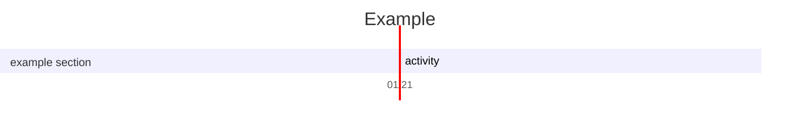
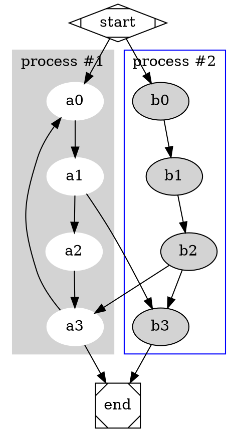
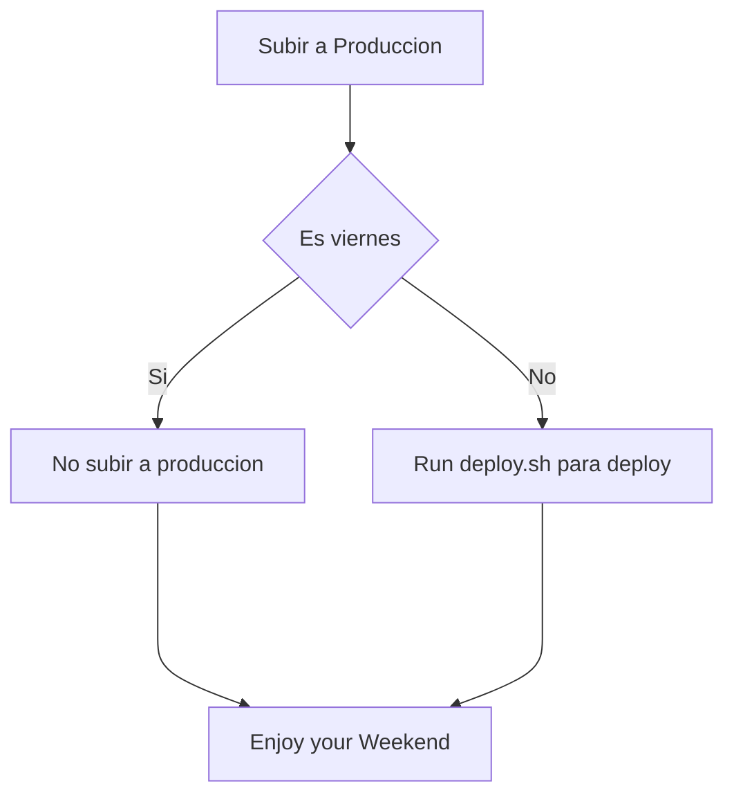

# TOC

${toc}
[[toc]]
[toc]
[[_toc_]]

# Cambiar el tamaño de la imagen 


@startuml
Bob -> Alice : hello
@enduml

# Plantuml

@startuml
Bob -> Alice : hello
@enduml

---

``` plantuml
Marco -> Belen : Hola Tolola
```

# Katex

$\sqrt{3x-1}+(1+x)^2$

$$\begin{array}{c}

\nabla \times \vec{\mathbf{B}} -\, \frac1c\, \frac{\partial\vec{\mathbf{E}}}{\partial t} &
= \frac{4\pi}{c}\vec{\mathbf{j}}    \nabla \cdot \vec{\mathbf{E}} & = 4 \pi \rho \\

\nabla \times \vec{\mathbf{E}}\, +\, \frac1c\, \frac{\partial\vec{\mathbf{B}}}{\partial t} & = \vec{\mathbf{0}} \\

\nabla \cdot \vec{\mathbf{B}} & = 0

\end{array}$$


# Mermaid




# Js-sequence-diagrama

``` sequence-diagrams
Pasajero\nConsulta->Agente\ndeViajes: Dice
Note right of China: Agencia\nAmadeus
Note left of Agencia\nMinorista: Consulta
Cliente-->>Agencia\nMinorista: Como haremos con este quilombo?
Agencia\nMinorista-->>Cliente: 
```


# Cliente y agencia

``` sequence-diagrams
Pasajeros-->Agencia: Consulta
Agencia->>Pasajero: Fecha\ncantidad pasajeros
Pasajero->Agencia: Respuesta
```


# Flowchart

``` flowchart
st=>start: Start|past:>http://www.google.com[blank]
e=>end: End|future:>http://www.google.com
op1=>operation: My Operation|past
op2=>operation: Stuff|current
sub1=>subroutine: My Subroutine|invalid
cond=>condition: Yes
or No?|approved:>http://www.google.com
c2=>condition: Good idea|rejected
io=>inputoutput: catch something...|future

st->op1(right)->cond
cond(yes, right)->c2
cond(no)->sub1(left)->op1
c2(yes)->io->e
c2(no)->op2->e
```


# Dot




# Chart

``` chart
{
  "type": "pie",
  "data": {
    "labels": [
      "Red",
      "Blue",
      "Yellow"
    ],
    "datasets": [
      {
        "data": [
          300,
          50,
          100
        ],
        "backgroundColor": [
          "#FF6384",
          "#36A2EB",
          "#FFCE56"
        ],
        "hoverBackgroundColor": [
          "#FF6384",
          "#36A2EB",
          "#FFCE56"
        ]
      }
    ]
  },
  "options": {}
}
```


# mermeid

```mermeid
graph LR
A-->B;
B-->C;
C-->A;
```
## Sample sequence diagram

Here is a Hello World example.

```sequence-diagram
Title: Hello world example
Bob->Alice: Hello
Alice-->Bob: How are you?
Note left of Bob: Bob thinks
Bob->>Alice: I'm good, thanks! How about you?
Alice-->Bob: I'm doing great, thank you!
```
---


## How to deploy



@startuml
Alice -> Bob: Authentication Request
Bob --> Alice: Authentication Response

Alice -> Bob: Another authentication Request
Alice <-- Bob: another authentication Response
@enduml

---

@startuml
Alice -> Bob: Authentication Request

alt successful case

    Bob -> Alice: Authentication Accepted

else some kind of failure

    Bob -> Alice: Authentication Failure
    group My own label
    Alice -> Log : Log attack start
        loop 1000 times
            Alice -> Bob: DNS Attack
        end
    Alice -> Log : Log attack end
    end

else Another type of failure

   Bob -> Alice: Please repeat

end
@enduml

---

@startuml
object London

map CapitalCity {
 UK *-> London
 USA => Washington
 Germany => Berlin
}
@enduml

---


@startuml
object London
object Washington
object Berlin
object NewYork

map CapitalCity {
 UK *-> London
 USA *--> Washington
 Germany *---> Berlin
}

NewYork --> CapitalCity::USA
@enduml

---

@startmindmap
* root node
	* some first level node
		* second level node
		* another second level node
	* another first level node
@endmindmap

---


@startuml
package foo {
    object baz
}

package bar {
    map A {
        b *-> foo.baz
        c =>
    }
}

A::c --> foo
@enduml

---

https://plantuml.com/es/salt


---

@startuml
[Prototype design] lasts 15 days
[Test prototype] lasts 10 days

Project starts 2020-07-01
[Prototype design] starts 2020-07-01
[Test prototype] starts 2020-07-16
@enduml

---


