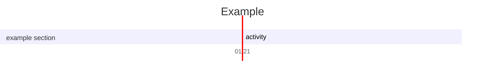
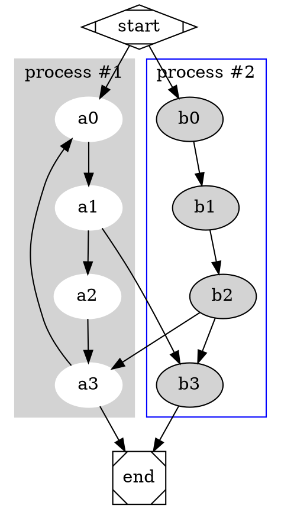
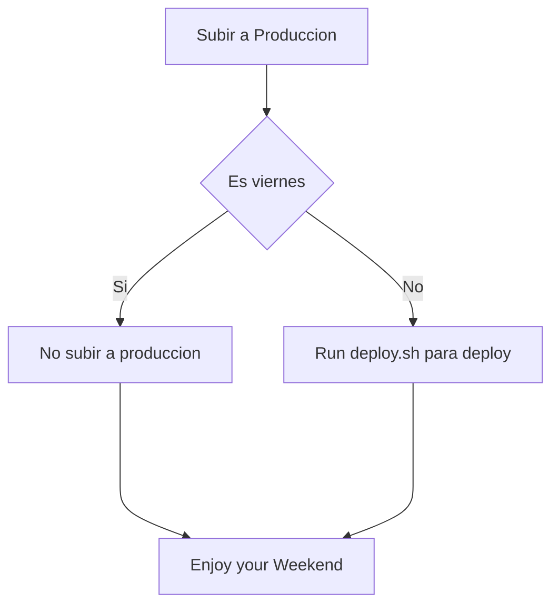
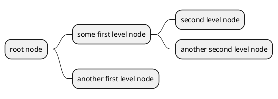
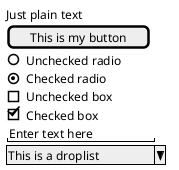
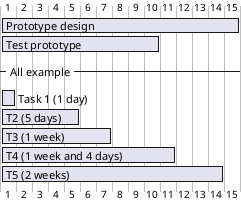
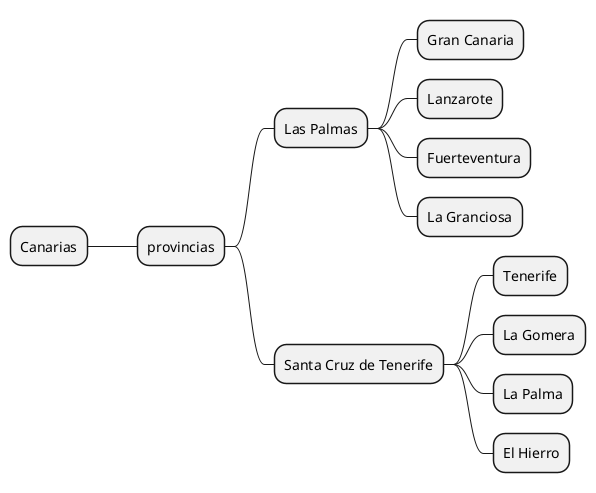

# TOC

${toc}
[[toc]]
[toc]
[[_toc_]]

# Cambiar el tamaño de la imagen 


@startuml
Bob -> Alice : hello
@enduml

# Plantuml

@startuml
Bob -> Alice : hello
@enduml

---

``` plantuml
Marco -> Belen : Hola Tolola
```

# Katex

$\sqrt{3x-1}+(1+x)^2$

$$\begin{array}{c}

\nabla \times \vec{\mathbf{B}} -\, \frac1c\, \frac{\partial\vec{\mathbf{E}}}{\partial t} &
= \frac{4\pi}{c}\vec{\mathbf{j}}    \nabla \cdot \vec{\mathbf{E}} & = 4 \pi \rho \\

\nabla \times \vec{\mathbf{E}}\, +\, \frac1c\, \frac{\partial\vec{\mathbf{B}}}{\partial t} & = \vec{\mathbf{0}} \\

\nabla \cdot \vec{\mathbf{B}} & = 0

\end{array}$$


# Mermaid




## Js-sequence-diagrama Original

``` sequence-diagrams
Pasajero\nConsulta->Agente\ndeViajes: Dice
Note right of China: Agencia\nAmadeus
Note left of Agencia\nMinorista: Consulta
Cliente-->>Agencia\nMinorista: Como haremos con este quilombo?
Agencia\nMinorista-->>Cliente: 
```

## Cliente y agencia

``` sequence-diagrams
Pasajeros-->Agencia: Consulta
Agencia->>Pasajero: Fecha\ncantidad pasajeros
Pasajero->Agencia: Respuesta
```

## Nueva etiqueta
``` sequence-diagrams
Pasajeros-->Agencia: Consulta
Agencia-->Pasajeros: Respuesta 

```

## Flowchart

``` flowchart
st=>start: Start|past:>http://www.google.com[blank]
e=>end: End|future:>http://www.google.com
op1=>operation: My Operation|past
op2=>operation: Stuff|current
sub1=>subroutine: My Subroutine|invalid
cond=>condition: Yes
or No?|approved:>http://www.google.com
c2=>condition: Good idea|rejected
io=>inputoutput: catch something...|future

st->op1(right)->cond
cond(yes, right)->c2
cond(no)->sub1(left)->op1
c2(yes)->io->e
c2(no)->op2->e
```


# Dot




# Chart
### Pirámide de William Glesser

``` chart
{
  "type": "pie",
  "data": {
    "labels": [
      "Leer",
      "Escuchar",
      "Mirar",
      "Ver, Oir",
      "Hablar, Preguntar, Repetir",
      "Hacer",
      "Enseñar"
    ],
    "datasets": [
      {
        "data": [
          1,
          2,
	  4,
	  8,
	  16,
	  32,
	  64          
        ],
"backgroundColor": [
          "#FF6384",
          "#36A2EB",
          "#FFCE56",
          "#F88C56",
          "#2FCE56",
          "#B9C5B6",
          "#EF3CE6"
        ],
        "hoverBackgroundColor": [
          "#FF6384",
          "#36A2EB",
          "#FFCE56",
          "#F88C56",
          "#2FCE56",
          "#B9CE56",
          "#EFCE56"
        ]
      }
    ]
  },
  "options": {}
}
```


# mermeid

```mermeid
graph LR
A-->B;
B-->C;
C-->A;
```
## Sample sequence diagram

Here is a Hello World example.

```sequence-diagram
Title: Hello world example
Bob->Alice: Hello
Alice-->Bob: How are you?
Note left of Bob: Bob thinks
Bob->>Alice: I'm good, thanks! How about you?
Alice-->Bob: I'm doing great, thank you!
```
---


## How to deploy



@startuml
Alice -> Bob: Authentication Request
Bob --> Alice: Authentication Response

Alice -> Bob: Another authentication Request
Alice <-- Bob: another authentication Response
@enduml

---

@startuml
Alice -> Bob: Authentication Request

alt successful case

    Bob -> Alice: Authentication Accepted

else some kind of failure

    Bob -> Alice: Authentication Failure
    group My own label
    Alice -> Log : Log attack start
        loop 1000 times
            Alice -> Bob: DNS Attack
        end
    Alice -> Log : Log attack end
    end

else Another type of failure

   Bob -> Alice: Please repeat

end
@enduml

---

@startuml
object London

map CapitalCity {
 UK *-> London
 USA => Washington
 Germany => Berlin
}
@enduml

---


@startuml
object London
object Washington
object Berlin
object NewYork

map CapitalCity {
 UK *-> London
 USA *--> Washington
 Germany *---> Berlin
}

NewYork --> CapitalCity::USA
@enduml

---


---

@startuml
package foo {
    object baz
}

package bar {
    map A {
        b *-> foo.baz
        c =>
    }
}

A::c --> foo
@enduml

---

https://plantuml.com/es/salt

---

@startuml
[Prototype design] lasts 15 days
[Test prototype] lasts 10 days

Project starts 2022-07-01
[Prototype design] starts 2022-07-01
[Test prototype] starts 2022-07-16
@enduml

---

@startuml PERT
left to right direction
' Horizontal lines: -->, <--, <-->
' Vertical lines: ->, <-, <->
title PERT: Project Name

map Kick.Off {
}
map task.1 {
    Start => End
}
map task.2 {
    Start => End
}
map task.3 {
    Start => End
}
map task.4 {
    Start => End
}
map task.5 {
    Start => End
}
Kick.Off --> task.1 : Label 1
Kick.Off --> task.2 : Label 2
Kick.Off --> task.3 : Label 3
task.1 --> task.4
task.2 --> task.4
task.3 --> task.4
task.4 --> task.5 : Label 4
@enduml

---

#### Agregar una nota a la izquierda

@startuml

[*] --> Active
Active --> Inactive

note left of Active : this is a short\nnote

note right of Inactive
  A note can also
  be defined on
  several lines
end note

@enduml

---

#### Participantes

@startuml
participant Participant [
    =Title
    ----
    ""SubTitle""
]

participant Bob

Participant -> Bob
@enduml

---

#### Autenticacion de servicio

@startuml
Alice -> Bob: Authentication Request

alt successful case

    Bob -> Alice: Authentication Accepted

else some kind of failure

    Bob -> Alice: Authentication Failure
    group My own label
    Alice -> Log : Log attack start
        loop 1000 times
            Alice -> Bob: DNS Attack
        end
    Alice -> Log : Log attack end
    end

else Another type of failure

   Bob -> Alice: Please repeat

end
@enduml

---


@startuml

box "Internal Service" #LightBlue
participant Bob
participant Alice
end box
participant Other

Bob -> Alice : hello
Alice -> Other : hello

@enduml


----
#### Colores
@startuml
skinparam backgroundColor #EEEBDC
skinparam handwritten true

skinparam sequence {
ArrowColor DeepSkyBlue
ActorBorderColor DeepSkyBlue
LifeLineBorderColor blue
LifeLineBackgroundColor #A9DCDF

ParticipantBorderColor DeepSkyBlue
ParticipantBackgroundColor DodgerBlue
ParticipantFontName Impact
ParticipantFontSize 17
ParticipantFontColor #A9DCDF

ActorBackgroundColor aqua
ActorFontColor DeepSkyBlue
ActorFontSize 17
ActorFontName Aapex
}

actor Usuario
participant "Primera Clase" as A
participant "Segunda Clase" as B
participant "Ultima Clase" as C

Usuario -> A: HacerTrabajo
activate A

A -> B: Crear Respuesta
activate B

B -> C: HacerTrabajo
activate C
C --> B: TrabajoHecho
destroy C

B --> A: RespuestaTerminada
deactivate B

A --> Usuario: Hecho
deactivate A

@enduml


---
### Practica servicio externo


@startuml

box "Aéreo Retail" #LightBlue
participant Pasajero
participant Agencia
end box
participant  Amadeus

Pasajero -> Agencia : Consulta\naéreo
Agencia -> Amadeus : FXD
Amadeus -> Agencia : Respuesta
Agencia --> Pasajero : Opciones\nOffers
Agencia --> Amadeus : Guarda\nOfertas
Agencia -->> Pasajero : 24hs.
@enduml

---
#### Estilo Json

```json
{
  "firstName": "Marco Adrián",
  "lastName": "Centurión",
  "Email": "aulavirtualturismo@gmail.com",
  "Tel/Whats": "+543513070654",
  "Web": "https://thconsultora.com.ar"
}
```

---


### Flujo Venta 

@startuml

!theme amiga 
skinparam handwritten true
box "Entrevista aéreo Retail"
Participant Pasajeros
Participant Agencia
end box
box "Servicios externos\na la agencia"
Participant Amadeus
end box

Pasajeros -> Agencia : Consulta\naéreo
Agencia -> Amadeus : Master Pricer FXD
Amadeus -> Agencia : Respuesta(S)
Agencia --> Pasajeros : Opciones\nOffers OFS
Agencia -> Amadeus : Guardar\nOfertas
note right of Amadeus : Dejar "leudar" el trabajo\nel pasajero ama autogestionarse
Pasajeros --> Agencia : 24hs. después\nllamada del pax
Agencia --> Agencia : Llamar al PAX
note right of Amadeus : Implementar un CRM para\nhacer seguimiento de todos los leads
Agencia -> Amadeus : Recuperar Oferta FXR 
Amadeus -> Agencia : Exito - Fracaso (mejorar markup)
Agencia -> Pasajeros : Se venció la tarifa \nTengo otra

@enduml

*******---

#### Ejemplo Salt


---
#### Prototipo


---


---

```plantuml
@startsalt
{^"Iniciar Sesión"
  Usuario:          | "HOMEROSIMP"
  ID de oficina:    | "BUEG12...."
  Contraseña:       | "******    "
  ¿Ha olvidado su contraseña?

[x]Recuerdame

[Inicio de sesión] | [   Borrar    ]
}
@endsalt```


