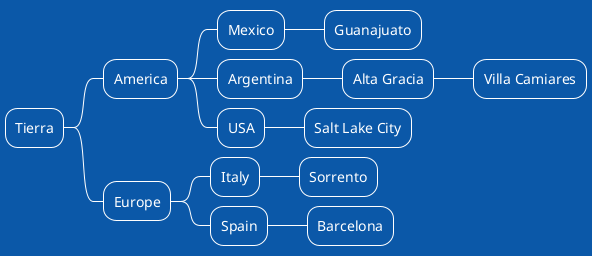

[[TOC]]

### Primer Despliegue

---

closeMarker - optional, defaults to @enduml. String to use as closing delimiter.
generateSource - optional, defaults to using public plant-uml server. Generates the src property of the image element.
diagramName - optional, defaults to uml. Name used by generateSoruce to generate diagram tags like @startuml, @startditaa, etc.
imageFormat - optional, defaults to svg. Format used by generateSource to generate the src of the image element.
render - optional, defaults to markdown-it image renderer. Renderer function for opening/closing tokens.
server - optional, defaults to http://www.plantuml.com/plantuml. Defines the plantuml server used for image generation.

---

### Componentes

@startuml
!theme amiga
component comp1 [
T H Consultora
==
www.thconsultora.com.ar
Tel/Whats: +543513070654
Email: marco@thconsultora.com.ar 
--
]
@enduml

---

