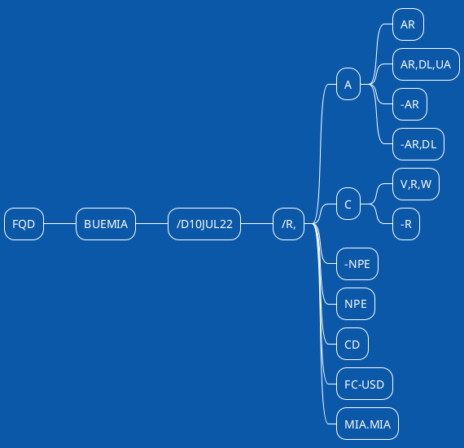

[[TOC]]

### Primer Despliegue

---

closeMarker - optional, defaults to @enduml. String to use as closing delimiter.
generateSource - optional, defaults to using public plant-uml server. Generates the src property of the image element.
diagramName - optional, defaults to uml. Name used by generateSoruce to generate diagram tags like @startuml, @startditaa, etc.
imageFormat - optional, defaults to svg. Format used by generateSource to generate the src of the image element.
render - optional, defaults to markdown-it image renderer. Renderer function for opening/closing tokens.
server - optional, defaults to http://www.plantuml.com/plantuml. Defines the plantuml server used for image generation.

---

### Componentes

@startuml
!theme amiga
component comp1 [
T H Consultora
==
www.thconsultora.com.ar
Tel/Whats: +543513070654
Email: marco@thconsultora.com.ar 
--
]
@enduml

---

### Postit

@startuml
note as n
Es muy importante destacar\nque sin embargo
------- 
No podríamos hacer mas enfático
====
que si no lo quisieramos
____
Buenas pácticas
..Recordatorio Importante..
//and title... //
==No generar duplicidades==
--Ni nombres ficticios--
A drisfrutar
end note
@enduml

---

### Nota monocromo reverso handwritting

@startuml
skinparam monochrome reverse
skinparam handwritten true
actor User
participant "First Class" as A
participant "Second Class" as B
participant "Last Class" as C
User -> A: DoWork
activate A
A -> B: Create Request
activate B
B -> C: DoWork
activate C
C --> B: WorkDone
destroy C
B --> A: Request Created
deactivate B
A --> User: Done
deactivate A
@enduml 
