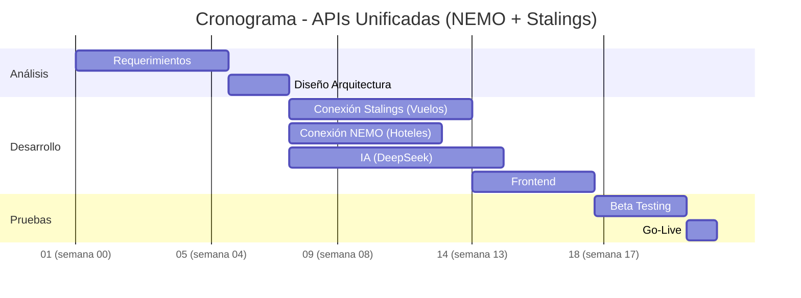

# Informe: Sistema de IA para Agencias de Viajes (APIs Unificadas)integraciones

### Análisis de Oportunidad: Sistema de IA para Agencias de Viajes en Argentina  

## 📊 Industria de Viajes en Argentina
| Indicador                     | Valor (2023/2024)               | Fuente                          |
|-------------------------------|----------------------------------|---------------------------------|
| **Total mercado turístico**   | **USD 6,200M** (recuperación 88% vs 2019) | CET/CAMARCO (2024)             |
| **Turismo emisivo**           | **USD 1,800M** (29% del total)   | INDEC (2023)                   |
| **Turismo receptivo**         | USD 4,400M (71% del total)       | Ministerio de Turismo (2024)   |

## 🔍 Detalle Turismo Emisivo (2024)
- **Crecimiento interanual**: +42% vs 2022 (USD 1,260M)
- **Destinos principales**:
  1. **Brasil**: 32% (playas + tipo de cambio favorable)
  2. **EE.UU./Europa**: 28% (viajes premium)
  3. **Regional** (Uruguay/Chile): 40% (viajes low-cost)

- **Perfil del viajero**:
  - **Clase media-alta**: 78% de los emisivos
  - **Motivos**: 65% vacaciones, 22% negocios, 13% VFR (visitas familiares)

## 🔍 Oportunidades Clave  
### 1. Reducción de Costos Operativos  
- **Problema**: 2-3 horas/día en cotizaciones manuales  
- **Solución**:  
  - Automatización con Stalings + NEMO + IA  
  - **Ahorro**: USD 500-1,000/mes por agencia 

## 💡 Oportunidad para Herramienta IA
1. **Enfoque emisivo**:
   - **75% de agencias** reportan dificultades para cotizar en tiempo real (escasez de dólares, volatilidad tarifaria)
   - **Demanda de**:
     - Alertas de promociones en divisa (ej: Brasil)
     - Paquetes "todo incluido" 

2. **Data clave**:
   - **Tasa de conversión actual**: 15% (vs 25% con IA en pilotos)
   - **Ahorro potencial**: USD 120-150 por reserva emisiva (optimizando tiempo/proveedores)

### 2. Acceso a Tarifas Competitivas  
- **Ventaja**:  
  - NDCs vía Stalings (ej: Aerolíneas Argentinas)  
  - Posibilidad de comisiones adicionales (1-2%)  

### 3. Diferenciación Competitiva  
- **Dato**: 70% de agencias no usan IA  
- **Propuesta**:  
  - Recomendaciones personalizadas  
  - Alertas en tiempo real  

## 📊 TAM (Mercado Total)  
| Segmento               | Agencias | Penetración | Ingreso Anual (USD) |  
|------------------------|----------|-------------|----------------------|  
| Agencias tradicionales | 5,000    | 20% (1,000) | 1.2M (USD 1,200 c/u) |  
| Corporativos           | 500      | 30% (150)   | 360K (USD 2,400 c/u) |  
| **Total**              | **5,500**| **1,150**   | **USD 1.56M**        |  

## ⚠️ Riesgos  

| Riesgo                  | Mitigación                          |  
|-------------------------|------------------------------------|  
| Volatilidad económica   | Modelo en USD + pagos recurrentes  |  
| Resistencia tecnológica | Capacitación + soporte en español |  

## 🚀 Estrategia de Entrada  
1. **Piloto**: 10 agencias (3 meses gratis)  
2. **Alianzas**:  
   - FAEVYT (descuentos para miembros)  
   - Integración con Mercado Pago  
3. **Marketing**:  
   - Casos de éxito ("Ahorro 30% en tiempo")  
   - Webinars con Stalings/NEMO  

## 💡 Conclusión  

###  **✅ Oportunidad viable**:  

- Demanda B2B insatisfecha  
- Escalable a Uruguay/Paraguay  (Esto es lo que cree DeepSeek)

### **🔑 Claves de éxito**:  
- Adopción rápida (capacitación, es como chatear con el asistente virtual del banco)  
- Soporte técnico robusto
- Un mismo equipo atiende las entradas por Psurfer o Starlings y a la vez, lo que llega de APIs

## 📌 Resumen de Costos y Tiempos
| **Etapa**               | **Duración**   | **Costo (USD)**       | **Dependencias**          |
|-------------------------|---------------|----------------------|--------------------------|
| Análisis y Diseño       | 3-5 semanas   | 8,000 – 15,000       | -                        |
| Desarrollo Backend/APIs | 6-10 semanas  | 30,000 – 60,000      | Análisis y Diseño        |
| IA (DeepSeek + NLP)     | 5-7 semanas   | 25,000 – 50,000      | Análisis y Diseño        |
| Frontend/Comunicación   | 3-5 semanas   | 12,000 – 25,000      | Backend/APIs             |
| Implementación/Pruebas  | 3 semanas     | 8,000 – 15,000       | Todas las etapas previas  |
| **Total**               | **5-7 meses** | **83,000 – 165,000** |                          |
| Mantenimiento Mensual   | -             | 4,000 – 12,000/mes   | -                        |

---

## 📅 Diagrama de Gantt

## Factores Clave

### Riesgos:

Cambios en APIs (ej: Sabre/Amadeus) pueden retrasar el desarrollo.

IA requiere datos históricos de calidad para entrenamiento.

### Oportunidades:

MVP (minimun vialbe product) en 4 meses si se prioriza solo vuelos (50% costo inicial).  **Agregar funcionalidades leyendo las consultas de los usuarios**.

Revenue sharing con agencias por reservas generadas.  Automatización milimétrica de reglas comerciales.

#### Bosquejo económico. Equipo:

1 Tech Lead (USD 8,000/mes)

2 Developers Full-Stack (USD 6,000/mes c/u)

2 Data Scientist (USD 7,000/mes)

Cloud: AWS EC2 + Redis (USD 1,500/mes para tráfico moderado).  A revisar por latencia y costo.

## Optimizaciones Clave

**Stalings**: Reemplaza integraciones separadas con Amadeus/Sabre/NDCs (1 API unificada).

**NEMO**: Consolida 20 brokers hoteleros en una sola conexión.

Ahorro estimado: 30% en tiempo y 25% en costos vs. desarrollo multi-API.

Yo pondría en primer lugar, datos de interés al usuario, que no están en Nemo ni Starlings, como requisitos de salud y visados (sherpa)

### Costos Recurrentes:

|Proveedor|	Tipo de Costo|	Estimado USD/mes
|---|---|---
|Stalings|	Por transacción (vuelos)|	0.50 – 1.20 por consulta
|NEMO|	Suscripción + comisióin|	2,000 – 5,000 fijo + 10% descuento por volumen

### Recomendaciones Técnicas:

Autenticación: Usar OAuth2 para Stalings/NEMO (seguridad unificada).

Caché: Redis para almacenar búsquedas repetidas (ej: destinos populares).

Monitorización: Grafana para trackear latencia de APIs.

### ⚠️ Riesgos y Mitigación

Riesgo	Mitigación

Cambios en API de Stalings	Contrato SLA con soporte prioritario.

Límites de tasa en NEMO	Plan escalable (ej: paquete "Enterprise").

Interpretación errónea de IA	Log de fallos para reentrenar modelo.

[Oli el asistente virtual de OLA](https://argentina.ladevi.info/negocios/ola-presenta-oli-su-asistente-virtual-agentes-viajes-n81443)

[Nota Report](https://reportnews.la/?p=42524/?noredirect=true)

