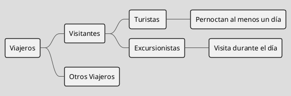
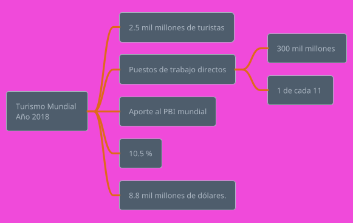
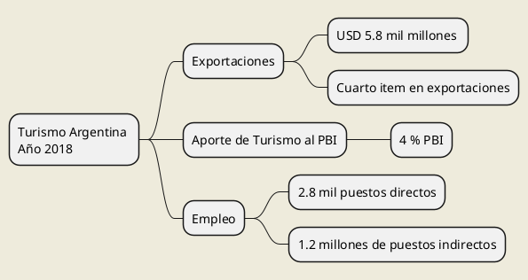
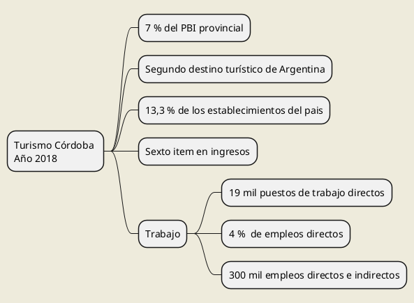

---



---


@startuml
skinparam backgroundColor #EEEBDC
component comp1 [
Plazas por tipo alojamiento * Porcentaje ocupación según tipo estab.:
---
Cantidad de personas que pernoctaron 
]
@enduml

@startuml
skinparam backgroundColor #EEEBDC
component comp1 [
Total de Visitantes Turistas * Valor Promedio del Gasto Turístico
---
Total del Gasto Turístico del Visitante Turista
]
@enduml

@startuml
skinparam backgroundColor #EEEBDC
component comp1 [
Total de Visitantes Turistas * Valor Promedio del Gasto Turístico
---
Total del Gasto Turístico del Visitante Turista
]
@enduml


---

@startuml
skinparam backgroundColor #EEEBDC
component comp1 [
Total visitantes excursionistas
*
Promedio del gasto excursionistas
-----------------------------
Total del Visitante excusionistas
]
@enduml


@startuml
skinparam backgroundColor #EEEBDC

component comp1 [
Cantidad de plazas por tipo de establecimiento de hospedaje
*
Porcentaje de ocupación según tipo de establecimiento. 
---
Cantidad de personas que pernoctaron en la ciudad.
]

@enduml


@startuml
skinparam backgroundColor #EEEBDC
component comp1 [
Número Visitantes Museo "Casa del Che"
-
Número Visitantes Turistas
-----------------------------
Total Visitantes Excursionistas
]
@enduml

@startuml
skinparam backgroundColor #EEEBDC
component comp1 [
Total Visitantes Excursionistas
*
Valor promedio del gasto Excursionistas
-----------------------------
Total del gasto turístico Visitantes Excursionistas
]
@enduml


@startuml
skinparam backgroundColor #EEEBDC
component comp1 [
Total Gasto Turistas
+
Total Gasto Excursionistas
-----------------------------
Aporte económico generado por los visitantes al destino
<code>
Excursionistas y Turistas
</code>
]
@enduml


---
@startuml

box "Entorno Habitual" #EEEBDC
note over Turista : $1200 gasto diario
participant Turista 
note over Excursionista : $350 gasto 
participant Excursionista
end box

box "Destino Prestadores Turísticos"
participant DestinoTurístico
end box

Turista -> DestinoTurístico : Gasto superior
Excursionista ->  DestinoTurístico : Gasto inferior

note right
Gasto de los visitantes $61.611.850
endnote

DestinoTurístico -> DestinoTurístico : Circulación del capital
DestinoTurístico -> DestinoTurístico : Reinversión

== Puestos de Trabajo ==

DestinoTurístico -> DestinoTurístico : Gasto de usuarios locales en el destino
note right
Empleo Directo 538
Puestos Temporales 43
Sector Público 52 empleos
endnote
== Efecto Multiplicador del Turismo ==
DestinoTurístico -> DestinoTurístico : Reinversión capital
note over DestinoTurístico : Mejora contínua 
@enduml


@startuml
help themes
@enduml


@startuml

box "Entorno Habitual" #LightBlue
participant Bob
participant Alice
end box
box "Destino Turístico"
participant Other
end box

Bob -> Alice : hello
Alice -> Other : hello

@enduml

```plantuml
@startmindmap
skinparam backgroundColor #EEEBDC
* Visitantes Internacionales 
**:Turistas
<code>
Visitantes que pernoctan
Permanecen en un medio de alojamiento colectivo
o privado por mas de una noche.
</code>
;
**:Visitantes de día
<code>
Visitantes que no pernoctan 
En un medio de alojamiento colectivo o privado
en el lugar visitado.
</code>
;
@endmindmap```
