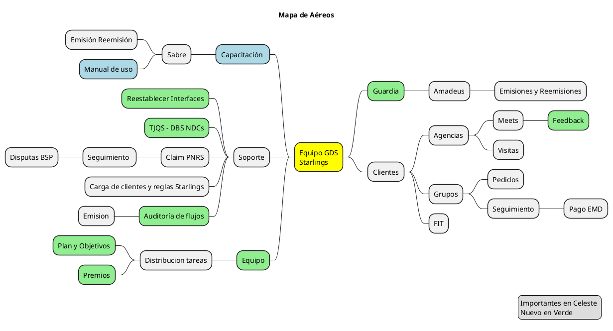

```plantuml
@startmindmap
title Mapa de Aéreos
*[#yellow] Equipo GDS\nStarlings
**[#lightgreen]  Guardia
*** Amadeus
**** Emisiones y Reemisiones
** Clientes
*** Agencias
**** Meets
*****[#lightgreen] Feedback
**** Visitas
*** Grupos
**** Pedidos
**** Seguimiento
***** Pago EMD
*** FIT

left side
**[#lightblue] Capacitación 
*** Sabre
**** Emisión Reemisión
****[#lightblue] Manual de uso
** Soporte
***[#lightgreen] Reestablecer Interfaces
***[#lightgreen] TJQS - DBS NDCs
*** Claim PNRS
**** Seguimiento 
***** Disputas BSP
*** Carga de clientes y reglas Starlings
***[#lightgreen] Auditoría de flujos
**** Emision
**[#lightgreen] Equipo
*** Distribucion tareas
****[#lightgreen]  Plan y Objetivos
****[#lightgreen]  Premios
legend right
   Importantes en Celeste 
   Nuevo en Verde  
endlegend
@endmindmapp
```
